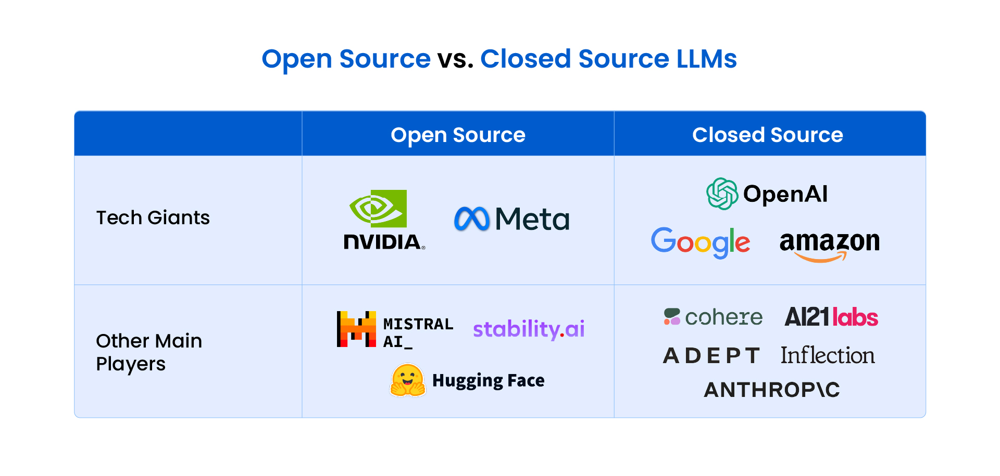

## 1.1 Large Language Models (LLMs)

Large Language Models (LLMs) are artificial intelligence models designed to understand and generate human-like text. They are trained on vast amounts of text data and can perform language-related tasks such as: Translation, Summarization, Question-answering, Coding, Content generation, etc.


*Open-source vs Closed-source LLMs*

### Open-source LLMs

- **Alibaba**: Qwen 3.6, Qwen 3.5, Qwen 3, Qwen 2.5
- **MoonshotAI**: Kimi 2.5, Kimi 2
- **ZAI**: GLM 5.1, GLM 5, 4.7, 4.6
- **Xiaomi**: MiMo V2 Flash
- **Meta**: LLaMA 4, LLaMA 3.3, LLaMA 3.2
- **Google**: Gemma 4, Gemma 3
- **Mistral**: Mistral Large 3, Mistral Small 3, Ministral 3, Devstral 3
- **OpenAI**: GPT-oss

📚 [Explore more open-source LLMs](https://huggingface.co/models)

### Closed-source LLMs

- **OpenAI**: GPT.5.5, GPT-5.4, GPT-5, GPT-4.1
- **Anthropic**: Claude 4.7 (Opus, Haiku, Sonnet), Claude 4.6 (Opus, Haiku, Sonnet), Claude 4.5, Claude 4
- **Google**: Gemini 3.1 (Pro, Flash), Gemini 2.5 (Pro, Flash)
- **Deepseek**: Deepseek Chat and Reasoner

**Note**: Companies like Groq, Cerebras, and SambaNova host open-source models on their hardware and provide APIs for inference.

---

## Hands-on:

Little hands-on practice with openai api to call GPT-5.4 for text generation:

```terminal
pip install openai
```

Run the following code snippet to call GPT-5.4 for text generation:

```python

from openai import OpenAI
client = OpenAI(api_key="your_api_key")

response = client.responses.create(
    model="gpt-5.4", 
    input="hi",
    temperature=0.7,     ## you'll learn about these parameters in the upcoming section on [Model Parameters and Key Terms](04-model-parameters.md)
    top_p=0.9,
    max_output_tokens=100
)

print(response.output_text)
```

[Explore more about openai models and their APIs](https://developers.openai.com/api/docs?lang=python)

If you don't have openai api access, you can experiment with groq api and call their hosted open-source models gpt-oss or mistral 3 for free:

```python


from openai import OpenAI

client = OpenAI(
    api_key="your_groq_api_key",  ## Get it for free from https://console.groq.com/keys
    base_url="https://api.groq.com/openai/v1",
)

response = client.responses.create(
    input="Explain the importance of fast language models",
    model="openai/gpt-oss-20b",
)
print(response.output_text)

```

[Explore more about groq models and their APIs](https://console.groq.com/docs/overview)

*We'll deep dive into how the LLM's architecture works in the upcoming section on*

---

**Next**: [Transformers and Other Architectures →](02-transformers-architecture.md)

[← Back to Index](README.md)
