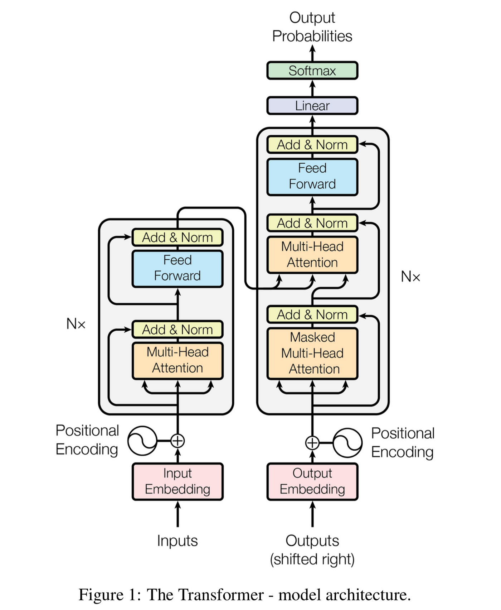
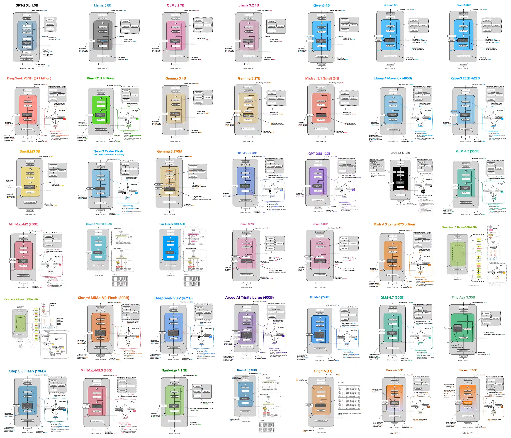

## Transformers and Other Architectures

Transformers are the core architecture behind modern generative models. They utilize attention mechanisms to process and generate text, enabling them to capture long-range dependencies and context effectively. The Transformer architecture, proposed in the paper "Attention is All You Need" by Vaswani et al. in 2017, has become the foundation for most large language models (LLMs) and other generative AI models.

### Key Components of Transformer Architecture

#### 1. Input Processing
- **Tokenization**: Converts text into tokens (subwords, words, or characters) that can be processed by the model. Different tokenizers include BPE (Byte Pair Encoding), WordPiece, and SentencePiece.

Note: You'll learn more about tokenization in the upcoming section on [Tokenization and Embeddings](03-tokenizers.md). This is very important for cost optimization and performance.

- **Embedding Layer**: Transforms tokens into dense vector representations (typically 512-4096 dimensions) that capture semantic meaning.
- **Positional Encoding**: Adds information about the position of tokens in the sequence using sinusoidal functions or learned embeddings, enabling the model to understand word order.

#### 2. Self-Attention Mechanism
- **Multi-Head Attention**: The core innovation of transformers. It allows the model to focus on different parts of the input simultaneously by:
  - Computing Query (Q), Key (K), and Value (V) matrices from the input
  - Calculating attention scores using scaled dot-product attention: `Attention(Q, K, V) = softmax(QK^T / √d_k)V`
  - Using multiple attention heads (typically 8-96 heads) to capture different types of relationships
  - Concatenating and projecting the outputs from all heads
- **Self-Attention**: Each token attends to all other tokens in the sequence, enabling the model to capture dependencies regardless of distance.
- **Masked Self-Attention**: Used in decoder layers to prevent attending to future tokens during autoregressive generation.
- **Cross-Attention**: Used in encoder-decoder models to allow the decoder to attend to encoder outputs.

#### 3. Processing Layers
- **Feedforward Neural Networks (FFN)**: Applied to each position independently, typically consisting of two linear transformations with a non-linear activation (GELU or ReLU) in between. Usually expands dimensionality by 4x (e.g., 768 → 3072 → 768).
- **Layer Normalization**: Normalizes activations across features for each token, stabilizing training and enabling deeper models.
- **Residual Connections**: Skip connections around each sub-layer that help gradients flow during backpropagation and allow training very deep networks (up to 100+ layers).
- **Dropout**: Applied for regularization to prevent overfitting during training.

#### 4. Transformer Variants

**Encoder-Only Models** (e.g., BERT, RoBERTa, ALBERT)
- Use bidirectional attention (can see entire context)
- Best for understanding tasks: classification, sentiment analysis, named entity recognition
- Apply masked language modeling during training

**Decoder-Only Models** (e.g., GPT-3/4, LLaMA, Mistral, Gemini)
- Use causal/masked attention (can only see previous tokens)
- Best for generation tasks: text completion, chatbots, code generation
- Apply autoregressive language modeling during training
- Most modern LLMs use this architecture

**Encoder-Decoder Models** (e.g., T5, BART, Flan-T5)
- Combine both encoder and decoder with cross-attention
- Best for sequence-to-sequence tasks: translation, summarization, question answering
- Encoder processes input, decoder generates output while attending to encoder states

### Training Techniques
- **Pre-training**: Models are trained on massive text corpora to learn language patterns and world knowledge
- **Fine-tuning**: Pre-trained models are adapted to specific tasks with smaller, task-specific datasets
- **Instruction Tuning**: Training on instruction-response pairs to follow human instructions better
- **RLHF (Reinforcement Learning from Human Feedback)**: Aligning model outputs with human preferences

You'll know more about training techniques in the upcoming section on [Training and Fine-tuning](20-training-generativeai-models.md).

### Key Innovations and Optimizations
- **Flash Attention**: Optimized attention computation that reduces memory usage and increases speed
- **Grouped Query Attention (GQA)**: Shares key-value heads across query heads to reduce memory and computation
- **Multi-Query Attention (MQA)**: Uses single key-value head for all query heads
- **Rotary Position Embeddings (RoPE)**: Encodes position information by rotating token embeddings
- **ALiBi (Attention with Linear Biases)**: Alternative positional encoding method that generalizes better to longer sequences
- **Sliding Window Attention**: Limits attention to a local window for efficiency with long sequences

### References
- [Transformers playlist on YouTube](https://www.youtube.com/playlist?list=PLUfbC589u-FSwnqsvTHXVcgmLg8UnbIy3) - Highly recommended for understanding the architecture in depth
- [The Illustrated Transformer](http://jalammar.github.io/illustrated-transformer/) - A visual and intuitive explanation of how transformers work
- [Attention is All You Need](https://arxiv.org/abs/1706.03762) - The original paper that introduced transformers (recommended for deeper understanding)

### Simulation of Transformer Architecture
[Simulate Transformer Architecture](https://poloclub.github.io/transformer-explainer/) - An interactive tool to visualize and understand how transformers process input and generate output.

---

## Alternative and Emerging Architectures

While transformers dominate the generative AI landscape, researchers continue to explore alternative architectures that address specific limitations such as computational complexity, memory requirements, and efficiency with long sequences.

1. Mixture of Experts (MoE) - Instead of using all model parameters for every input, MoE models route each input to a subset of "expert" networks, significantly improving efficiency.
2. State Space Models (SSMs) - Mamba Combines the parallelizable training of transformers with the efficient inference of recurrent models.
3. RWKV (Receptance Weighted Key Value) - A novel RNN-like architecture that combines linear attention with recurrent processing.
4. Diffusion-Based Architectures - Generate outputs by iteratively denoising random noise through learned diffusion processes.
5. Retentive Networks (RetNet) - Designed as the "successor to transformers" with retention mechanism replacing attention.
6. Hyena and Long Convolution Models - Use implicitly parameterized long convolutions instead of attention.
7. Hybrid Architectures - Many recent models combine multiple architectural approaches:

The field continues to evolve rapidly, with new architectures emerging that challenge transformer dominance, particularly for specific use cases like extremely long sequences, real-time applications, and resource-constrained environments. 

Reference:
- [Different Architectures in Latest Models](https://sebastianraschka.com/llm-architecture-gallery/) - A comprehensive overview of the architectures used in recent models, including MoE, SSM, RWKV, and more. Must-read for understanding the diversity of approaches in modern generative AI.

---

*Checkout the tokenization techniques used in these architectures in the next section.*

[<- Previous: Introduction to LLM's](01-introduction-to-llms.md) | [Next: Tokenization and It's Types→](03-tokenizers.md)

[← Back to Index](README.md)
