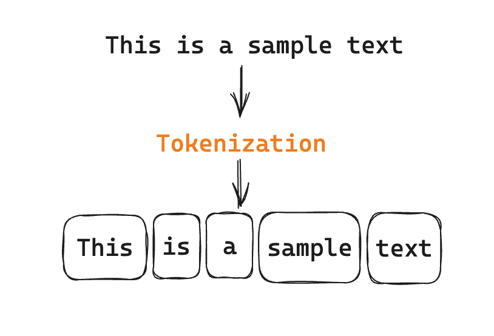

## Tokenization

The tokenization process involves dividing input text and output text into smaller units, known as tokens, suitable for processing by LLMs. Tokens can be words, subwords, characters, or symbols, depending on the model's type and size.



Tokenization enables LLMs to navigate different languages, formats, and vocabularies, reducing computational and memory costs.

### Why Do We Need to Tokenize?
Tokenization plays an essential role in shaping the quality and diversity of generated text, by influencing the meaning and context of the tokens in LLMs. In addition to text segmentation, it optimizes resource usage, expedites processing, and facilitates adept management of linguistic complexes. 

Essential for contextual understanding, tokenization improves an LLM's effectiveness in tasks like summarization and translation — with acknowledged limitations such as language bias and dialect challenges.

---

## Tokenization Algorithms

Here are some important types of tokenization algorithms:

### 1. Whitespace Tokenization

This tokenizer uses whitespace characters such as spaces, tabs, and newlines to separate words. It's a simple method that doesn't consider linguistic structures, often used as a baseline tokenizer in text processing.

**Example**: `"Hello, World"` → `["Hello,", "World"]`

**Python Implementation**:
```python

def whitespace_tokenize(text):
    """Split text by whitespace characters"""
    return text.split()

text = "Hello, World! This is tokenization."
tokens = whitespace_tokenize(text)
print(tokens)
# Output: ['Hello,', 'World!', 'This', 'is', 'tokenization.']
```

---

### 2. Sentence Tokenization

Sentence tokenization involves using punctuation and context to break text into sentences. It helps in higher-level language understanding by dividing text into meaningful units. It also aids in various NLP tasks such as sentiment analysis and machine translation.

**Example**: `"This is a sentence. And this is another."` → `["This is a sentence.", "And this is another."]`

**Python Implementation**:
```python
import re


def sentence_tokenize(text):
    sentences = re.split(r'[.!?]+\s*', text)
    return [s.strip() for s in sentences if s.strip()]

try:
    import nltk
    nltk.download('punkt', quiet=True)
    
    def sentence_tokenize_nltk(text):
        return nltk.sent_tokenize(text)
    
    text = "This is a sentence. And this is another! What about questions?"
    tokens = sentence_tokenize_nltk(text)
    print(tokens)
    # Output: ['This is a sentence.', 'And this is another!', 'What about questions?']
except ImportError:
    print("NLTK not installed. Use: pip install nltk")
```

---

### 3. Word Tokenization

Word tokenization uses language-specific rules to segment text into individual words. It takes into account common word delimiters like spaces and punctuation marks, providing a fundamental approach for processing natural language text.

**Example**: `"This is a programmer."` → `["This", "is", "a", "programmer"]`

**Python Implementation**:
```python
import re

def word_tokenize(text):
    words = re.findall(r'\b\w+\b', text)
    return words

try:
    import nltk
    nltk.download('punkt', quiet=True)
    
    def word_tokenize_nltk(text):
        """Split text into words using NLTK"""
        return nltk.word_tokenize(text)
    
    text = "This is a programmer. He codes in Python!"
    tokens = word_tokenize_nltk(text)
    print(tokens)
    # Output: ['This', 'is', 'a', 'programmer', '.', 'He', 'codes', 'in', 'Python', '!']
except ImportError:
    tokens = word_tokenize(text)
    print(tokens)
    # Output: ['This', 'is', 'a', 'programmer', 'He', 'codes', 'in', 'Python']
```

---

### 4. Byte Pair Encoding (BPE)

BPE is a data compression technique that is applied in tokenization by merging frequently occurring pairs of characters. This process creates a vocabulary of subword units, effectively representing words and enabling the handling of rare or out-of-vocabulary terms.

**Example**: Given the input text `"abracadabra"`, BPE might iteratively merge the most frequent character pairs, resulting in subword units like `{"abrc", "a", "d", "ab", "r", "c"}`. Tokenizing the original text using this vocabulary yields `["abrc", "a", "d", "a", "br", "a"]`.

**Python Implementation**:
```python
from collections import Counter
import re

def get_stats(vocab):
    pairs = Counter()
    for word, freq in vocab.items():
        symbols = word.split()
        for i in range(len(symbols) - 1):
            pairs[symbols[i], symbols[i + 1]] += freq
    return pairs

def merge_vocab(pair, vocab):
    bigram = re.escape(' '.join(pair))
    pattern = re.compile(r'(?<!\S)' + bigram + r'(?!\S)')
    new_vocab = {}
    for word, freq in vocab.items():
        new_word = pattern.sub(''.join(pair), word)
        new_vocab[new_word] = freq
    return new_vocab

def bpe_tokenize(text, num_merges=10):
    vocab = {}
    for word in text.split():
        word_chars = ' '.join(list(word))
        vocab[word_chars] = vocab.get(word_chars, 0) + 1
    
    for i in range(num_merges):
        pairs = get_stats(vocab)
        if not pairs:
            break
        best_pair = max(pairs, key=pairs.get)
        vocab = merge_vocab(best_pair, vocab)
    
    tokens = []
    for word in text.split():
        word_chars = ' '.join(list(word))
        for v in vocab:
            if v.replace(' ', '') == word:
                tokens.extend(v.split())
                break
    return tokens

try:
    from tokenizers import Tokenizer
    from tokenizers.models import BPE
    from tokenizers.trainers import BpeTrainer
    from tokenizers.pre_tokenizers import Whitespace
    
    def bpe_tokenize_hf(text, vocab_size=1000):
        tokenizer = Tokenizer(BPE())
        tokenizer.pre_tokenizer = Whitespace()
        
        trainer = BpeTrainer(vocab_size=vocab_size, special_tokens=["<PAD>", "<UNK>"])
        tokenizer.train_from_iterator([text], trainer=trainer)
        
        output = tokenizer.encode(text)
        return output.tokens
    
    text = "low lower lowest"
    tokens = bpe_tokenize_hf(text)
    print(tokens)
except ImportError:
    print("Install tokenizers: pip install tokenizers")
    text = "low lower lowest"
    tokens = bpe_tokenize(text, num_merges=5)
    print(tokens)
```

Note: Most of the modern LLMs (like GPT, LLaMA, Mistral) use BPE tokenization or its variants, making it crucial to understand for working with these models effectively.

---

### 5. Subword Tokenization

Subword tokenization breaks down words into smaller units, allowing the model to handle unseen words and improve generalization. It is commonly employed in neural machine translation and other tasks where subword representations are beneficial.

**Example**: `"unhappiness"` → `["un", "happi", "ness"]`

---

### 6. Tokenization Using Regular Expressions

This method utilizes predefined patterns encoded in regular expressions to tokenize text. It is a flexible approach that allows customization based on specific tokenization rules, making it suitable for tasks with unique text processing requirements.

**Example**: `"abc123xyz"` → `["abc", "123", "xyz"]`

---

### 7. Maximum Matching Tokenizer

The maximum matching tokenizer segments text by selecting the longest possible match from a dictionary. It is often employed in languages with limited word boundaries, providing a heuristic-based approach to tokenization.

**Example**: `"applepie"` → `["apple", "pie"]`

---

### 8. Treebank Tokenizer

The Treebank tokenizer adheres to the conventions outlined in the Penn Treebank, a widely used corpus in NLP. It tokenizes text based on grammatical structures, helping maintain consistency in tokenization across various applications.

**Example**: `"It's raining cats and dogs."` → `["It", "'s", "raining", "cats", "and", "dogs", "."]`

---

## Summary and Best Practices

### When to Use Each Tokenizer:

| Tokenizer | Best Use Case | Pros | Cons |
|-----------|--------------|------|------|
| **Whitespace** | Quick prototyping, simple applications | Fast, simple | Doesn't handle punctuation |
| **Sentence** | Document analysis, summarization | Preserves sentence structure | Struggles with abbreviations |
| **Word** | General NLP tasks | Language-aware | Struggles with unknown words |
| **BPE** | Modern LLMs (GPT, LLaMA) | Handles rare words, efficient | Complex to implement |
| **Subword** | Neural translation, BERT models | Good generalization | Requires pre-trained vocabulary |
| **Regex** | Custom text formats, structured data | Highly flexible | Requires regex knowledge |
| **Maximum Matching** | Asian languages (Chinese, Japanese) | Good for no-space languages | Dictionary dependent |
| **Treebank** | Linguistic analysis, parsing | Grammatically consistent | English-focused |

---
## Hands-on :

### 1. OpenAI Tokenizer Tools

Try OpenAI tokenizer tool or SDK to experiment with different tokenization methods and understand how they affect model performance and cost.

[OpenAI Tokenizer Tool](https://platform.openai.com/tokenizer) - A web-based tool to visualize how different tokenization methods break down text and to understand token counts for cost estimation.

[OpenAI Tiktoken SDK](https://github.com/openai/tiktoken/tree/main) - A Python library for tokenization that supports various algorithms, including BPE. It allows you to experiment with tokenization in your own projects and understand how it impacts model performance and cost.

### 2. Hugging Face Tokenizers

Hugging Face provides a powerful library for tokenization that supports multiple algorithms and is widely used in the NLP community. You can experiment with different tokenizers and see how they affect the input text.

[Hugging Face Tokenizers](https://github.com/huggingface/tokenizers) - A comprehensive library for tokenization that supports various algorithms, including BPE, WordPiece, and SentencePiece. It allows you to experiment with tokenization in your own projects and understand how it impacts model performance and cost.

---

*Let's deep dive into model parameters and their impact on inference in the next section.*

**Next**: [Model Parameters](04-model-parameters.md)

[← Back to Index](README.md)
