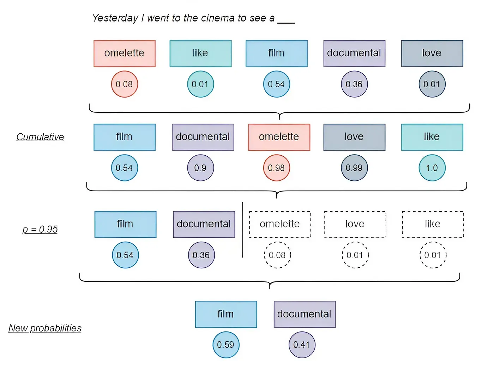
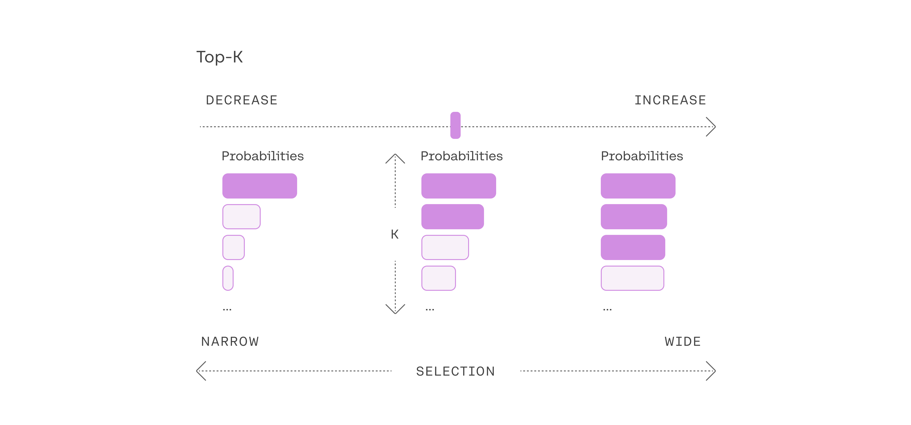
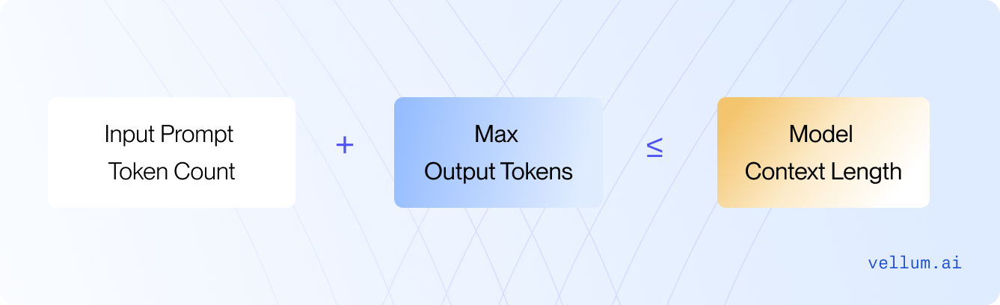
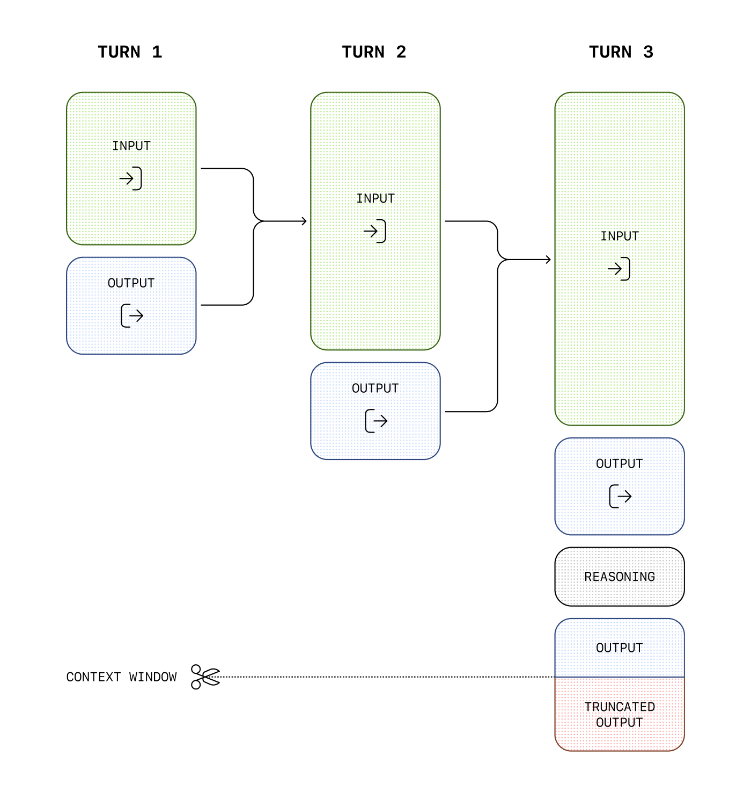
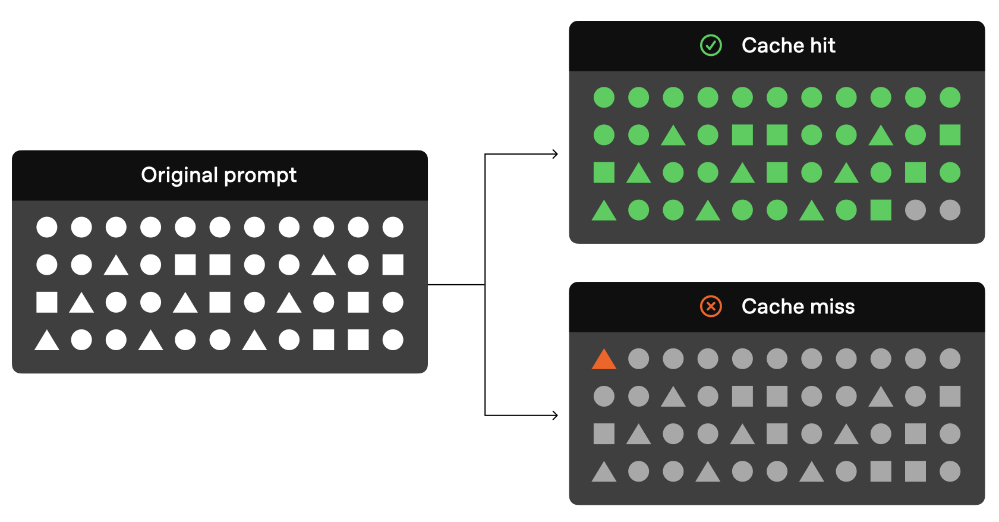

## Model Parameters and Key Terms

Parameters are the variables that control the behavior of a model during training and inference. They determine how the model processes input data and generates output. Understanding these parameters is crucial for fine-tuning model performance and achieving desired results.


---

## Python Code Example

```python
from openai import OpenAI

client = OpenAI(api_key="your_api_key")

response = client.chat.completions.create(
    model="gpt-5.4-mini",

    messages=[
        {"role": "system", "content": "You are a helpful assistant."},
        {"role": "user",   "content": "Write a short poem about the sea."}
    ],

    temperature=0.7,        # 0 = deterministic, 2 = very random
    top_p=0.9,              # nucleus sampling: consider tokens covering 90% prob mass
    # top_k not exposed in OpenAI API (used in Anthropic, Google, Mistral, etc.)

    max_tokens=200,         # hard cap on response length
    frequency_penalty=0.3,  # reduce word repetition (-2 to 2)
    presence_penalty=0.2,   # encourage topic diversity (-2 to 2)

    stop=["\n\n", "END"],   # stop generating at these sequences
    seed=42,                # for reproducibility
    n=1,                    # how many completions to generate
)

print(response.choices[0].message.content)
```

---

## Detailed Parameter Explanations

### 1. Model
- The specific language model to use (e.g., "gpt-4o", "claude-3", "gemini-pro")
- Different models have different capabilities, context window sizes, and cost structures 
- Always check the model documentation for supported parameters and best practices

### 2. Messages

Messages are the input format for chat-based models, consisting of a list of dictionaries with "role" and "content". Common roles include:

- **system**: Instructions or context for the model (e.g., "You are a helpful assistant.")
- **user**: The user's input or query
- **assistant**: The model's previous responses (used for multi-turn conversations)

You'll learn more about crafting effective messages and prompts in the upcoming section [Context Management](05-context-management.md).


### 3. Temperature
The temperature parameter controls the randomness of the generated text. Adjusting the temperature changes how the model selects the next word in a sequence, influencing the creativity and predictability of the output. Low temperatures render outputs that are predictable and repetitive. Conversely, high temperatures encourage LLMs to produce more random, creative responses.

**Range**: 0.0 to 2.0 (typical range: 0.0 to 1.0)


**How it works**:
- **Temperature = 0**: Deterministic (always picks highest probability token) - greedy decoding
- **Temperature < 1**: Makes the model more confident, sharper probability distribution
- **Temperature = 1**: Uses the model's raw probabilities as-is
- **Temperature > 1**: Flattens the distribution, making lower-probability tokens more likely

---

### 5. Top-p (Nucleus Sampling)
Top P , also known as nucleus sampling , is a setting supported by some LLMs; it determines which tokens should be considered when generating a response.

**Range**: 0.0 to 1.0



**How it works**:
1. Sort tokens by probability (highest to lowest)
2. Keep adding tokens until cumulative probability ≥ p
3. Sample only from this subset
4. Dynamically adjusts vocabulary size based on confidence

**Use cases**:
- **0.1 - 0.5**: Very focused, conservative responses
- **0.7 - 0.9**: Balanced, most common setting
- **0.95 - 1.0**: More diverse vocabulary, exploratory

**Interaction with temperature**:
- Apply temperature FIRST (scales logits)
- Then apply top-p (filters tokens)
- Most APIs use both together

---

### 4. Top-k
Top K is a setting supported by some LLMs; it determines how many of the most likely tokens should be considered when generating a response.

**Range**: 1 to vocabulary_size (typically 1 to 100)



**How it works**:
1. Sort tokens by probability
2. Keep only the top k tokens
3. Renormalize probabilities
4. Sample from this fixed-size subset

**Comparison with top-p**:
- **Top-k**: Fixed number of candidates
- **Top-p**: Dynamic number based on probability mass
- Top-p is generally preferred in modern systems

**Use cases**:
- **k = 1**: Greedy decoding (deterministic)
- **k = 10-20**: Very focused, conservative
- **k = 40-50**: Balanced (common default)
- **k = 100+**: More exploratory

---

### 6. Max Tokens
The max_tokens parameter specifies the maximum number of tokens that can be generated in the chat completion.



**Range**: 1 to model's context window

**Important notes**:
- Does NOT guarantee this many tokens (model may finish early)
- Includes ALL output tokens, not just the visible text
- Different from context window (which includes input + output)

**Typical values**:
- **50-100**: Short answers, snippets
- **200-500**: Paragraphs, explanations
- **1000-2000**: Articles, essays
- **4000+**: Long-form content, documentation

**Cost consideration**: You're charged for tokens generated, so set appropriately.

---

### 7. Frequency Penalty
The frequency penalty parameter tells the model not to repeat a word that has already been used multiple times in the conversation.

It basically tells the model, “You’ve already used that word a lot—try something else.” The higher the penalty, the less repetitions in the generated text.

**Range**: -2.0 to 2.0 (OpenAI), typically 0.0 to 2.0

**Formula**: `penalty = frequency_penalty × (token_count / total_tokens)`

**How it works**:
- Positive values (0 to 2): Discourage repetition
- Higher counts → stronger penalty
- Proportional to frequency of occurrence

**Use cases**:
- **0.0**: No penalty (default)
- **0.3-0.6**: Mild reduction in repetition
- **0.8-1.0**: Strong anti-repetition for varied writing
- **1.5-2.0**: Maximum diversity (can hurt coherence)

---

### 8. Presence Penalty
The Presence Penalty parameter prevents the model from repeating a word, even if it’s only been used once. It basically tells the model, “You’ve already used that word once — try something else.”

**Range**: -2.0 to 2.0 (OpenAI), typically 0.0 to 2.0

**Formula**: `penalty = presence_penalty × (1 if token appeared else 0)`

**Difference from frequency penalty**:
- **Frequency**: Stronger penalty for tokens used multiple times
- **Presence**: Same penalty whether token used once or 100 times
- **Presence**: Better for encouraging topic diversity

**Use cases**:
- **0.0**: No penalty (default)
- **0.3-0.6**: Encourage covering different topics/aspects
- **0.8-1.2**: Strong push for novel content
- **1.5-2.0**: Maximum topic diversity

---

### 9. Stop Sequences
Tells the model to stop generating when it encounters any of these sequences.

**Use cases**:
- Control output format
- Prevent unwanted continuation
- Enforce structure

---

### 10. Seed (Deterministic Outputs)
The seed parameter helps you get consistent LLM outputs, making your results more predictable. To enable it, you can specify an arbitrary number in your request to get (mostly) consistent results each time.

**Type**: Integer(For example: 42)

**Important notes**:
- Must combine with `temperature=0` for true determinism
- Not all providers support this
- System-level changes can still affect outputs
- Beta feature in most APIs

**Use cases**:
- Testing and debugging
- Reproducible experiments
- A/B testing prompts
---

### 11. N (Number of Completions)
Generate multiple independent completions for the same prompt.

**Type**: Integer (typically 1-10)

**Important notes**:
- Each completion counts toward your token usage
- Returned in `choices` array
- Useful for comparing alternatives

---
## Other terms to know:
- **Context Window**: Total tokens (input + output) that the model can process. this is a hard limit based on the model architecture (e.g., 1M tokens for GPT-5.4, 8192+ for GPT-4).



- **Prompt caching**: Storing previous prompts and responses to speed up inference for repeated queries.




## Best Practices and Common Configurations

### Configuration Presets

#### 1. **Code Generation**
```python
{
    "temperature": 0.0,
    "top_p": 0.95,
    "max_tokens": 1000,
    "frequency_penalty": 0.0,
    "presence_penalty": 0.0
}
```
*Why*: Deterministic, focused, allows necessary repetition of keywords

#### 2. **Chatbot / Customer Support**
```python
{
    "temperature": 0.7,
    "top_p": 0.9,
    "max_tokens": 500,
    "frequency_penalty": 0.3,
    "presence_penalty": 0.1
}
```
*Why*: Balanced, natural, slight variety to avoid robotic responses

#### 3. **Creative Writing**
```python
{
    "temperature": 1.0,
    "top_p": 0.95,
    "max_tokens": 2000,
    "frequency_penalty": 0.5,
    "presence_penalty": 0.5
}
```
*Why*: More random, diverse vocabulary, explores different topics

#### 4. **Data Extraction / Classification**
```python
{
    "temperature": 0.0,
    "top_p": 1.0,
    "max_tokens": 100,
    "frequency_penalty": 0.0,
    "presence_penalty": 0.0
}
```
*Why*: Deterministic, consistent, short outputs

#### 5. **Brainstorming / Ideation**
```python
{
    "temperature": 1.2,
    "top_p": 0.95,
    "max_tokens": 1500,
    "frequency_penalty": 0.7,
    "presence_penalty": 0.6
}
```
*Why*: High creativity, strong encouragement for diverse ideas


## References and Further Reading

- [Temperature, top-k, top-p explanation in Youtube](https://www.youtube.com/watch?v=jnikMver_CE) <---- Must watch for understanding these parameters in depth.
- [Top k and Top p sampling explained](https://www.youtube.com/watch?v=_3DWwb96exY) <---- Another great video for understanding sampling techniques.
- [LLM Parameters Explained](https://www.vellum.ai/llm-parameters-guide) <---- A comprehensive blog of all key parameters.

- [OpenAI API Documentation - Chat Completions](https://platform.openai.com/docs/api-reference/chat)
- [Anthropic Claude API Documentation](https://platform.claude.com/docs/en/api/messages/create)


*We will cover more advanced techniques for controlling model outputs, such as prompt engineering and context management, in the upcoming sections.*

**Next**: [Context Management](05-context-management.md)

[← Back to Index](README.md)
