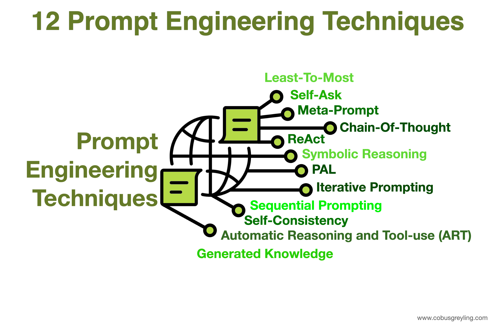

# Prompting Strategies for Engineers

Prompting is not just "asking questions nicely." For engineers, it's about **controlling model behavior programmatically** — getting structured outputs, enforcing formats, reducing hallucinations, and making the model behave like a reliable software component.

Think of it as writing an interface contract: you define what goes in, what comes out, and what happens in edge cases.



---

## Key Prompting Strategies

1. **Zero-Shot Prompting** — Give the model a task description and let it figure out the rest. Best for simple, well-defined tasks.
2. **Few-Shot Prompting** — Provide a few input-output examples inside the prompt to guide the model. Great for tasks where you want to demonstrate a specific format or style.
3. **Chain-of-Thought Prompting** — Encourage the model to "think step by step" by asking it to include intermediate reasoning before answering. This significantly improves performance on complex tasks.

and more ....

To explore more advanced strategies, check out the full guide: [Prompt Engineering](https://www.promptingguide.ai/techniques).

---

## Common Issues in Prompting

### 1. Model Drift

A system prompt that works well with one model may not work with another. Each model has its own instruction-following behavior, tone defaults, and response tendencies. Always test and adjust your prompts for each model you deploy on — do not assume a prompt transfers directly.

---

### 2. Conflicting Instructions

Most people use AI tools to generate their system prompts without fully understanding the underlying business logic. The result is a prompt that contains instructions that contradict each other. When the model encounters conflicting rules, it gets confused and produces inconsistent or poor-quality responses.

**Always review and test generated prompts before using them in production.**

Here is a real example of a conflicting prompt:

```python
system_prompt = """
You are a helpful assistant helping customers with their orders.

Instructions:
- Be concise. Keep all responses under 50 words.
- Always provide a detailed explanation of the return policy when a customer asks about returns.
- Never mention refunds under any circumstances.
- If a customer asks about a refund, explain the full refund process step by step.
"""
```

**What's wrong here:**

| Conflict | Rule A | Rule B |
|----------|--------|--------|
| Length | "Keep responses under 50 words" | "Provide a detailed explanation" |
| Refunds | "Never mention refunds" | "Explain the full refund process" |

The model has no way to satisfy both rules at the same time. It will either ignore one instruction, blend them inconsistently, or behave differently on every run.

---

### 3. Over-Prompting

Adding too many instructions or examples can overwhelm the model and lead to worse performance. A long, dense prompt increases the chance that the model ignores or misweights some instructions.

Keep prompts focused. Start minimal — add instructions only when the output breaks.

```
❌ 20 rules covering every edge case imaginable
✅ 5 clear rules covering the most common scenarios, with edge cases handled in code
```

---

> **Rule of thumb:** If you had to explain your system prompt to a new teammate, and they found it confusing — the model will too. Clarity for humans equals clarity for models.


*Now that you understand the core prompting strategies and common pitfalls, let's move on to how to manage conversation context effectively to further improve your application's performance. let's move into hands-on*

---

[← Previous: Context Management](05-context-management.md) | [Next: Hands-on Practice with APIs →](07-hands-on-practice.md)

[← Back to Index](README.md)
