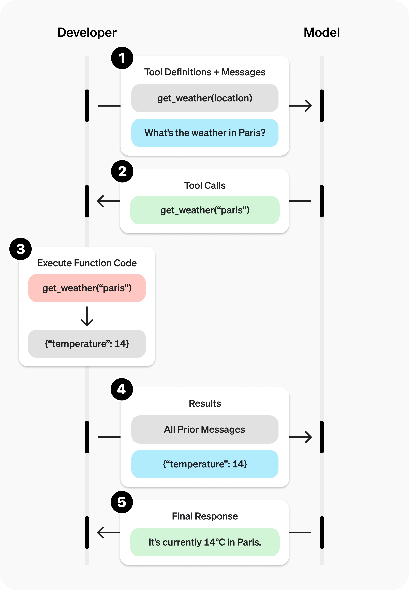

# Function Calling

Function calling is a powerful feature in generative AI that allows you to define and call functions within your prompts. This can help you structure your prompts more effectively and enable the model to perform specific tasks or calculations.



In simple terms, it allows you to bring some external data to the model. so model knows that it can call a function to get that data instead of making up an answer. This is especially useful for things like:
- Getting real-time information (e.g., current weather, stock prices)
- Performing calculations (e.g., math problems, unit conversions)
- Accessing databases or APIs (e.g., retrieving user information, fetching product details)
- Running code (e.g., executing Python code, running SQL queries)
- And much more!


## Python Example

Here's a simple example of how to use function calling with the OpenAI API in Python:

```python

from openai import OpenAI
import json

client = OpenAI()

tools = [
    {
        "type": "function",
        "name": "get_weather",
        "description": "Get the weather forecast for a specific location.",
        "parameters": {
            "type": "object",
            "properties": {
                "location": {
                    "type": "string",
                    "description": "A location like New York or London",
                },
            },
            "required": ["location"],
        },
    },
]

def get_weather(location: str) -> str:
    return f"{location}: The weather forecast for next Tuesday is sunny with a chance of rain."

# Create a running input list we will add to over time
input_list = [
    {"role": "user", "content": "What is the weather like in New York next Tuesday?"}
]

# 2. Prompt the model with tools defined
response = client.responses.create(
    model="gpt-5",
    tools=tools,
    input=input_list,
)

# Save function call outputs for subsequent requests
input_list += response.output

for item in response.output:
    if item.type == "function_call":
        if item.name == "get_weather":
            # 3. Execute the function logic for get_weather
            location = json.loads(item.arguments)["location"]
            weather = get_weather(location)
            
            # 4. Provide function call results to the model
            input_list.append({
                "type": "function_call_output",
                "call_id": item.call_id,
                "output": weather,
            })

print("Final input:")
print(input_list)

response = client.responses.create(
    model="gpt-5",
    instructions="Respond only with a weather forecast generated by a tool.",
    tools=tools,
    input=input_list,
)

# 5. The model should be able to give a response!
print("Final output:")
print(response.model_dump_json(indent=2))
print("\n" + response.output_text)

```

*Note: This is also called agentic prompting, where the model can decide to call tools on its own when it thinks it can help answer the user's question.*

In this example, we define a tool called `get_weather` that takes a location as input and returns a weather forecast. We then prompt the model with a user question about the weather in New York next Tuesday. The model recognizes that it can call the `get_weather` function, so it generates a function call with the appropriate arguments. We execute the function logic and provide the results back to the model, which can then generate a final response based on the function output.

In agentic module, you can see more complex examples of function calling, including how to handle multiple tools, manage state across function calls, and create more sophisticated agent behaviors.

Refercences:
- [Function calling explanation on youtube](https://www.youtube.com/watch?v=gMeTK6zzaO4)

- [OpenAI Function Calling Documentation](https://developers.openai.com/api/docs/guides/function-calling)
- [Claude Function Calling Documentation](https://platform.claude.com/docs/en/agents-and-tools/tool-use/overview)
- [Gemini Function Calling Documentation](https://ai.google.dev/gemini-api/docs/function-calling?example=meeting)


**Next**: [Streaming Outputs](10-streaming-outputs.md)

[← Back to Index](README.md)
