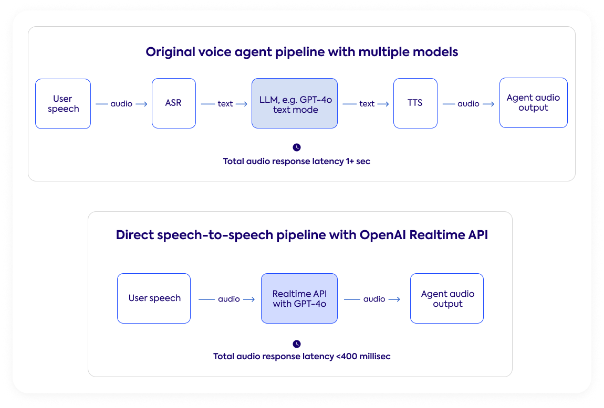

# Real-time APIs

The Realtime API allows you to receive tokens, function calls, and tool calls as they are generated by the model, enabling you to build applications that can respond in real-time to user input. This is especially useful for applications like voice assistants, phone call agents, and interactive agents where low latency is crucial.

To use the Realtime API, you need to set up a WebSocket connection to the OpenAI API endpoint. Once connected, you can send your input and receive responses in real-time as they are generated by the model.

Previously, we saw tts and stt models that can be used for real-time applications. The Realtime API allows you to integrate these models into your applications and receive responses in real-time, enabling you to build more interactive and responsive applications with low latency.

## Optimized Models for Real-time Applications

Models like `gpt-realtime-1.5` and `gemini-3.1-flash-live-preview` are optimized for real-time applications and can be used with the Realtime API to achieve low latency responses.

## Further Reading

To learn more about the Realtime API and how to use it, check out the following resources:

- [OpenAI API documentation](https://developers.openai.com/api/docs/guides/realtime)
- [Gemini API documentation](https://ai.google.dev/gemini-api/docs/live-api)

**Next**: [Embeddings Models](12-embeddings-semantic-search.md)

[← Back to Index](README.md)
