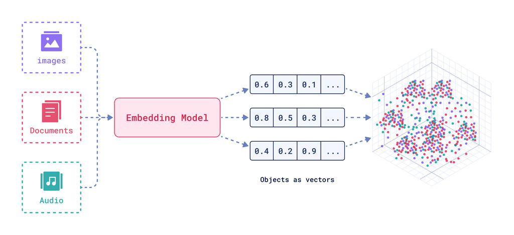

## 11.1 Embeddings and Rerankers

**Embeddings** are numerical representations of data (text, images, or audio) that capture semantic meaning and relationships. They are used in:
- Natural language processing
- Computer vision
- Recommendation systems
- Semantic search

*Embeddings represent data in a continuous vector space, enabling machines to understand and process complex relationships.*

In NLP, word embeddings represent words in a continuous vector space where similar words are closer together.

**Rerankers** take a list of candidate outputs (like search results) and rank them based on relevance or quality. They are often used with LLMs to improve output quality.

*Rerankers evaluate and reorder candidate outputs to enhance relevance and quality.*

### Open-source Embeddings and Rerankers

- **Microsoft**: harrier-oss-v1-27b
- **Google**: EmbeddingGemma-300m
- **Alibaba**: Qwen3-embedding

📚 [Explore more open-source embeddings](https://huggingface.co/models)

### Closed-source Embeddings and Rerankers

- **OpenAI**: Text-embedding-3-small, Text-embedding-3-large
- **Google** (Multi-modality support): gemini-embedding-2, gemini-embedding-1
- **Cohere**: Embed v4, Embed v3, Reranker v4, Reranker v3
- **Jina AI**: Jina Embeddings 2.0, Jina Embeddings 1.0, Jina Reranker V3

Note: In RAG modules, you'll know why the embeddings and rerankers are important and how to use them effectively for semantic search and retrieval.

---

*Now that you understand the basics of embeddings and rerankers, let's explore how to use them for semantic search and vector databases in the next section.*

---

[← Previous: Real-time APIs](11-realtime-apis.md) | [Next: Text-to-Speech (TTS) and Speech-to-Text (STT) Models →](13-tts-and-stt.md)

[← Back to Index](README.md)
