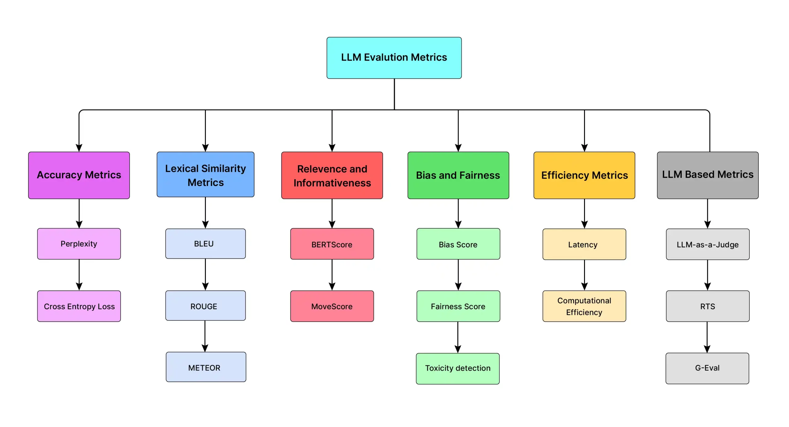

# Understanding LLM Evaluation Metrics

Evaluating LLMs requires a comprehensive approach, employing a range of measures to assess various aspects of their performance. In this discussion, we explore key evaluation criteria for LLMs, including accuracy and performance, bias and fairness, as well as other important metrics.



## Why Evaluation is Hard for LLMs

Traditional software has deterministic outputs — you assert `result == expected` and move on. LLMs produce **natural language**, which is:

- Non-deterministic (same prompt, different output each run)
- Open-ended (many valid answers exist)
- Context-dependent (correctness depends on the use case)

This means you need **multiple types of metrics**, not a single pass/fail score.

---

## Two Categories of Metrics

```
LLM Evaluation
├── Technical Metrics   → measure output quality objectively
│   ├── Reference-Based  (compare against a ground truth)
│   └── Reference-Free   (judge quality without a reference)
└── Business Metrics    → measure real-world impact
```

---

## Part 1: Technical Metrics

### 1. Perplexity

**What it measures:** How confidently the model predicts the next token. Lower perplexity = the model finds the text more natural and expected.

**Formula:**

```
Perplexity = exp( -1/N × Σ log P(token_i) )

Where:
  N        = total number of tokens
  P(token) = model's predicted probability for each token
```

**Intuition:** Give the model a sentence — how surprised is it by each word? A well-trained model on familiar text will have low perplexity. High perplexity means the model is struggling with the content.

**When to use it:** Comparing base model quality, evaluating fine-tuning progress, or checking if a model handles your domain well.

**Limitation:** Perplexity measures fluency, not correctness. A confidently wrong answer can have low perplexity.

---

### 2. BLEU (Bilingual Evaluation Understudy)

**What it measures:** Overlap between the model's output and a reference answer using n-gram matching. Originally designed for machine translation.

**Formula (simplified):**

```
BLEU = BP × exp( Σ wₙ × log(precision_n) )

Where:
  BP           = brevity penalty (penalizes short outputs)
  precision_n  = fraction of model's n-grams that appear in the reference
  wₙ           = weight for each n-gram size (usually equal)
```

**Score range:** 0 to 1 (or 0–100). Higher is better.

**When to use it:** Translation tasks, text generation with a clear reference output.

**Limitation:** BLEU only checks word overlap — it penalizes valid paraphrases. "The car is fast" and "The vehicle is quick" score poorly against each other despite meaning the same thing. Do not rely on BLEU alone for open-ended generation.

---

### 3. ROUGE (Recall-Oriented Understudy for Gisting Evaluation)

**What it measures:** Overlap between the model's output and a reference, focused on **recall** — how much of the reference is covered by the output. Designed for summarization tasks.

**Three main variants:**

| Variant | What it counts |
|---------|---------------|
| ROUGE-1 | Unigram (single word) overlap |
| ROUGE-2 | Bigram (two-word phrase) overlap |
| ROUGE-L | Longest common subsequence — captures sentence-level structure |

**When to use it:** Summarization, document compression, any task where coverage of the source material matters.

**Limitation:** Like BLEU, ROUGE is blind to semantics. It rewards lexical overlap, not meaning.

---

### 4. Answer Relevancy

**What it measures:** Whether the model's response actually addresses the user's question — not just topically, but directly. This is a **reference-free** metric (no ground truth needed).

**How it works:** Embed both the question and the answer, then compute cosine similarity. A highly relevant answer will be semantically close to the question.

**When to use it:** RAG pipelines, chatbots, any question-answering system where staying on-topic is critical.

---

### 5. Faithfulness / Hallucination Detection

**What it measures:** Whether the model's answer is grounded in the provided context — or whether it fabricated information. This is the most important metric for any RAG system.

**How it works:**

```
Given: [context] + [question] + [model answer]

Check: Does every claim in the answer exist in or follow from the context?

Score = claims supported by context / total claims in answer
```

**When to use it:** Every RAG application. Hallucination is the single biggest trust problem in production LLM systems.

---

### 6. Correctness (Factual Accuracy)

**What it measures:** Whether the answer is factually correct against a known ground truth — not just relevant, but right.

---

### Technical Metrics — Summary

| Metric | Type | Needs Reference? | Best For |
|--------|------|-----------------|----------|
| Perplexity | Reference-free | No | Model quality, fine-tuning |
| BLEU | Reference-based | Yes | Translation |
| ROUGE | Reference-based | Yes | Summarization |
| Answer Relevancy | Reference-free | No | Q&A, RAG, chatbots |
| Faithfulness | Reference-free | No (uses context) | RAG hallucination detection |
| Correctness | Reference-based | Yes | Any factual task |

---

## Part 2: Business Metrics

Technical metrics tell you if the model is producing good output. Business metrics tell you if it's delivering real value. You need both.

---

### 1. Benchmark Comparisons

Run your model against standardized benchmarks to establish a capability baseline and to detect regression when you update prompts or swap models.

| Benchmark | What It Tests |
|-----------|--------------|
| MMLU | General knowledge across 57 subjects |
| HumanEval | Python code generation |
| HellaSwag | Commonsense reasoning |
| TruthfulQA | Resistance to hallucination |
| GSM8K | Grade school math reasoning |

For production systems, also maintain an **internal benchmark** — a curated set of real user queries with expected outputs specific to your domain. Generic benchmarks do not reflect your actual workload.

---

### 2. Task Completion Rate

**What it measures:** The percentage of user requests the system successfully completed without failure, refusal, or the user abandoning the session.

Track this per intent category to find exactly where the model is struggling.

---

### 3. User Satisfaction Score (CSAT)

**What it measures:** Direct user feedback on response quality — the most honest signal you have about real-world usefulness.

Common implementations: 👍 / 👎 thumbs on each response, 1–5 star ratings after a session, or a standard CSAT question ("How satisfied were you?" 1–10).

---

### 4. Latency and Cost per Query

**What it measures:** How fast and how expensive each model call is. These directly affect user experience and your infrastructure budget.

**Rough targets:**

| Metric | Acceptable | Good | Excellent |
|--------|-----------|------|-----------|
| Latency (p50) | < 3s | < 1.5s | < 800ms |
| Latency (p99) | < 8s | < 4s | < 2s |
| Cost per query | < $0.01 | < $0.003 | < $0.001 |

---

### 5. Return on Investment (ROI)

**What it measures:** Whether the LLM feature delivers measurable business value relative to its running cost.

```
ROI = (Value Delivered - Cost of Running LLM) / Cost of Running LLM × 100%
```

Value is use-case dependent:

| Use Case | Value Signal |
|----------|-------------|
| Support chatbot | Tickets deflected × avg cost per ticket |
| Code assistant | Engineering hours saved × hourly rate |
| Document summarizer | Documents processed × time saved per doc |
| Fraud detection | Fraud prevented × avg loss per case |

---

### Business Metrics — Summary

| Metric | What It Tells You | How to Measure |
|--------|------------------|----------------|
| Benchmark score | Model capability baseline | Standard datasets + internal evals |
| Task completion rate | How often the model actually helps | Successful responses / total requests |
| User satisfaction | Real user perception | Ratings, thumbs, CSAT |
| Latency | Response speed | p50 / p99 per call |
| Cost per query | Infrastructure efficiency | Token usage × price per token |
| ROI | Business justification | Value delivered vs. running cost |

---

## A Continuous Evaluation Pipeline

In production, technical and business metrics run together in a continuous loop — not just at launch.

```
Prompt change or new model version
            ↓
Run internal benchmark
(faithfulness, relevancy, correctness)
            ↓
Compare against previous version baseline
            ↓
Shadow deploy — log outputs with no user impact
            ↓
Monitor latency, cost, and task completion rate
            ↓
Collect user feedback (thumbs / CSAT)
            ↓
Promote to production   ──or──   Roll back
```

---

## Final Summary

| What you want to know | Metric to use |
|-----------------------|--------------|
| Is the model fluent? | Perplexity |
| Is the translation accurate? | BLEU |
| Does the summary cover the source? | ROUGE |
| Is the answer on-topic? | Answer Relevancy |
| Did the model make things up? | Faithfulness |
| Is the answer factually right? | Correctness |
| Does it work in my domain? | Internal benchmark |
| Do users find it useful? | CSAT / thumbs |
| Is it fast enough? | Latency (p50, p99) |
| Is it worth the cost? | Cost per query + ROI |

📚 **Further reading:** 
[LLM Evaluation — DataCamp](https://www.datacamp.com/blog/llm-evaluation) 
[LLM Evaluation — Analytics Vidhya](https://www.analyticsvidhya.com/blog/2025/03/llm-evaluation-metrics/)

> **Key insight:** No single metric tells the full story. Use technical metrics to debug model quality and business metrics to justify the product. Run both continuously — not just at launch.

---

[← Previous: Image and Video Generation Models](14-image-and-video-generation.md) | [Next: Inference Metrics →](16-inference-metrics.md)

[← Back to Index](README.md)
