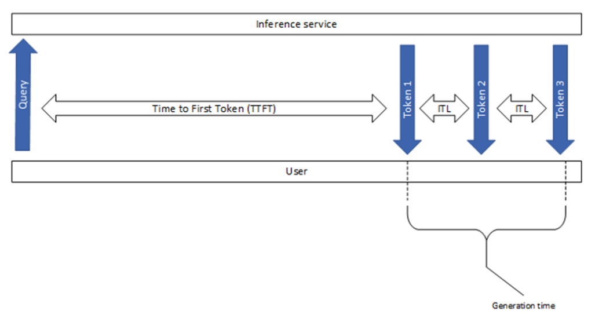

## Understanding LLM Inference Metrics

Inference metrics are crucial for evaluating the performance of your LLM applications in real-world scenarios. These metrics help you understand how efficiently your model generates responses, how much it costs to run, and how it performs under different conditions.

Key performance indicators:
- **Latency**: Total generation time, Time to first token (TTFT) and time per output token (TPOT)
- **Throughput**: Requests per second, tokens per second
- **Memory usage**: GPU/CPU memory consumption
- **Cost efficiency**: Cost per token, cost per request

📚 [Read more about inference metrics](https://bentoml.com/llm/inference-optimization/llm-inference-metrics)

[Inference metrics by NVIDIA](https://docs.nvidia.com/nim/benchmarking/llm/latest/metrics.html)

---

[← Previous: Evaluation Metrics](15-evaluation-metrics.md) | [Next: Benchmarking and Optimization →](17-benchmarks.md)

[← Back to Index](README.md)
