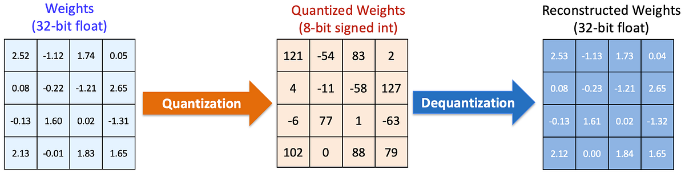

## Quantization

Quantization is a powerful technique for optimizing large language models (LLMs) by reducing their precision, which leads to smaller model sizes and faster inference times. This is especially important for deploying LLMs in production environments where resources may be limited.

Techniques for optimizing LLMs and reducing model size:
- **Bits and bytes**: Reducing precision from 16-bit to 8-bit or 4-bit
- **GPTQ**: Post-training quantization
- **AWQ**: Activation-aware Weight Quantization
- **GGUF**: Efficient format for CPU inference
- **APEX**: novel quantization technique for Mixture-of-Experts language models
- **Unsloth Dynamic 2.0 Quants(UD)**: New 2.0 version of our Dynamic GGUF + Quants. Dynamic 2.0 achieves superior accuracy & SOTA quantization performance.
- **TurboQuant**: Compression method that achieves a high reduction in model size with zero accuracy loss, ideal for supporting both key-value (KV) cache compression and vector search.

**Benefits**:
- Reduced memory footprint
- Faster inference
- Lower deployment costs
- Minimal accuracy loss

📚 [Read more about quantization](https://cast.ai/blog/demystifying-quantizations-llms/)
