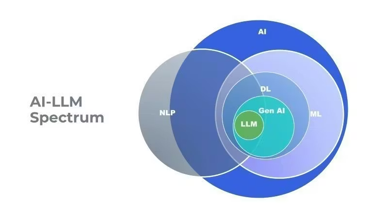

# Basics of Generative AI

Welcome to the Basics of Generative AI module! This comprehensive guide covers everything you need to know to get started with generative AI, from understanding different models to deploying them in production.

## 📚 Table of Contents

### Foundation
1. [**Introduction to Large Language Models**](01-introduction-to-llms.md)
   - What are LLMs and how they work
   - Open-source vs Closed-source models
   - Common use cases and applications

2. [**Transformers and Other Architectures**](02-transformers-architecture.md)
   - Core architecture behind modern generative models
   - Attention mechanisms
   - Model architecture patterns

3. [**Understanding Tokenizers**](03-tokenizers.md)
   - Text to token conversion
   - Tokenization strategies (BPE, WordPiece, SentencePiece)
   - Token limits and optimization

4. [**Model Parameters and Key Terms**](04-model-parameters.md)
   - Top-k, Top-p, Temperature
   - Context window, Max tokens
   - Frequency/Presence penalties

### Practical Skills

5. [**Context Management**](07-context-management.md)
   - Managing conversation history
   - Rolling window, Recursive summarization
   - Selective retention
   - Best practices for long conversations
6. [**Prompting Best Practices and Strategies**](06-prompting-strategies.md)
   - Prompt engineering techniques
   - Few-shot learning, Chain-of-thought prompting
   - Role-based prompting, System messages

7. [**Hands-on Practice with APIs**](05-hands-on-practice.md)
   - Working with OpenAI, Google Gemini, Claude, Groq APIs
   - Text generation and basic interactions

8. [**Structured Output Generation**](08-structured-output.md)
   - Generating JSON and structured data
   - Schema validation
   - Framework support (Pydantic, JSON Schema)

### Integration 

9. [**Function Calling**](09-function-calling.md)
   - API-based function calling
   - Framework implementations
   - Tool use and execution

10. [**Streaming Outputs**](10-streaming-outputs.md)
    - Streaming text generation
    - WebSocket integration
    - Handling partial responses

11. [**Real-time APIs**](12-realtime-apis.md)
    - Voice-to-voice systems
    - OpenAI real-time API
    - Low-latency implementations

### Other-model 

12. [**Embeddings and Semantic Search**](11-embeddings-semantic-search.md)
    - Understanding embeddings and rerankers
    - Vector databases
    - Similarity search and retrieval

13. [**Text-to-Speech (TTS) and Speech-to-Text (STT)**](13-text-to-speech.md)
    - TTS and STT models and providers
    - Voice customization
    - Streaming audio output

14. [**Image and Video Generation**](14-image-and-video-generation.md)
    - Text-to-image and video models
    - Open-source vs closed-source options
    - Practical applications

### Evaluation & Quality 

15. [**LLM Evaluation Metrics**](15-evaluation-metrics.md)
    - Technical Metrics (Perplexity, BLEU, ROUGE)
    - Business Metrics (ROI, Customer satisfaction)
    - Quality assessment

16. [**LLM Inference Metrics**](16-inference-metrics.md)
    - Latency, Throughput
    - Memory usage, Cost efficiency
    - Performance optimization

17. [**Understanding LLM Benchmarks**](17-benchmarks.md)
    - GPQA, MMLU-PRO, AIME
    - LiveCode Bench, MuSR, HLE
    - How to interpret benchmark scores

18. [**LLM Leaderboards**](18-leaderboards.md)
    - Artificial Analysis, Vellum, Scale.com
    - Hugging Face, Live Bench
    - Choosing the right model

### Advanced & Production  <- Optional for beginners>
19. [**LLM Fine-tuning (Hands-on)**](19-fine-tuning.md)
    - Pre-training and data preparation
    - Fine-tuning Techniques (PEFT, LoRA, QLoRA)
    - Preference Alignment (RLHF, DPO, PPO)

20. [**Quantization**](20-quantization.md)
    - INT8, INT4 Quantization
    - GPTQ, AWQ, GGUF
    - Benefits and trade-offs

21. [**Model Hosting and Inference**](21-model-hosting.md)
    - Inference Servers (vLLM, SGLang, Triton, LitServe)
    - Deployment best practices
    - Scaling considerations
    - Batching, KV Cache
    - Speculative decoding, Continuous batching
    - Model parallelism, Tensor parallelism

*We have covered basics of generative AI in this section. The next sections will cover RAG (Retrieval-Augmented Generation) and AI Agents, which are more advanced topics that build on these fundamentals.*

Next: [Retrieval-Augmented Generation (RAG)](../02-Retrieval%20Augmented%20Generation/README.md)

[← Back to Main Guide](../README.md)

