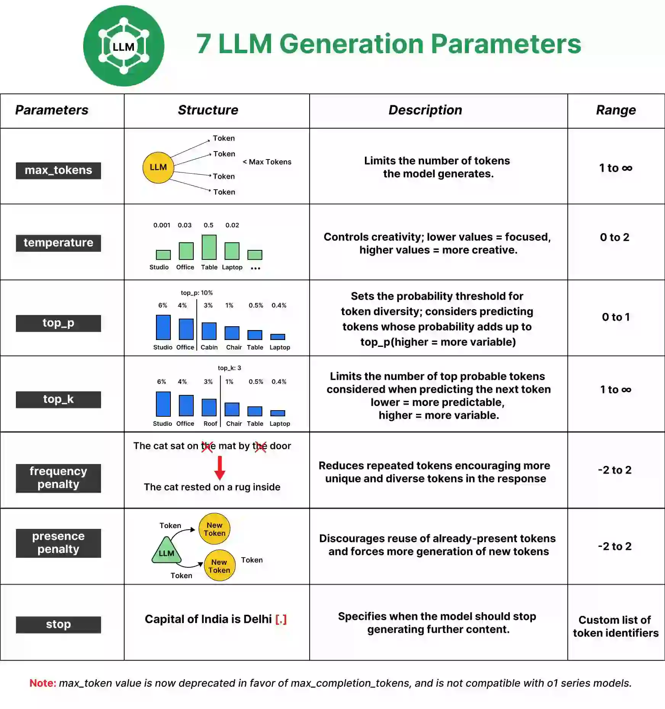

## Model Parameters and Key Terms

Parameters are the variables that control the behavior of a model during training and inference. They determine how the model processes input data and generates output. Understanding these parameters is crucial for fine-tuning model performance and achieving desired results.



---

## Python Code Example

```python
from openai import OpenAI

client = OpenAI(api_key="your_api_key")

response = client.chat.completions.create(
    model="gpt-4o-mini",

    messages=[
        {"role": "system", "content": "You are a helpful assistant."},
        {"role": "user",   "content": "Write a short poem about the sea."}
    ],

    temperature=0.7,        # 0 = deterministic, 2 = very random
    top_p=0.9,              # nucleus sampling: consider tokens covering 90% prob mass
    # top_k not exposed in OpenAI API (used in Anthropic, Google, Mistral, etc.)

    max_tokens=200,         # hard cap on response length
    frequency_penalty=0.3,  # reduce word repetition (-2 to 2)
    presence_penalty=0.2,   # encourage topic diversity (-2 to 2)

    stop=["\n\n", "END"],   # stop generating at these sequences
    seed=42,                # for reproducibility
    n=1,                    # how many completions to generate
)

print(response.choices[0].message.content)
```

---

## Detailed Parameter Explanations

### 1. Model
- The specific language model to use (e.g., "gpt-4o", "claude-3", "gemini-pro")
- Different models have different capabilities, context window sizes, and cost structures 
- Always check the model documentation for supported parameters and best practices

### 2. Messages

Messages are the input format for chat-based models, consisting of a list of dictionaries with "role" and "content". Common roles include:

- **system**: Instructions or context for the model (e.g., "You are a helpful assistant.")
- **user**: The user's input or query
- **assistant**: The model's previous responses (used for multi-turn conversations)

You'll learn more about crafting effective messages and prompts in the upcoming sections on [Prompt Engineering](06-prompt-strategies.md) and [Context Management](07-context-management.md).


### 3. Temperature
**Range**: 0.0 to 2.0 (typical range: 0.0 to 1.0)

**What it does**: Controls randomness in the output by scaling the logits (pre-softmax scores) before sampling.

**How it works**:
- **Temperature = 0**: Deterministic (always picks highest probability token) - greedy decoding
- **Temperature < 1**: Makes the model more confident, sharper probability distribution
- **Temperature = 1**: Uses the model's raw probabilities as-is
- **Temperature > 1**: Flattens the distribution, making lower-probability tokens more likely

**Use cases**:
- **0.0 - 0.3**: Code generation, math problems, factual Q&A, structured data extraction
- **0.5 - 0.8**: General chatbots, customer support, professional writing
- **0.8 - 1.2**: Creative writing, brainstorming, diverse responses
- **1.5 - 2.0**: Experimental, highly creative fiction, poetry (risk of incoherence)

---

### 5. Top-p (Nucleus Sampling)
**Range**: 0.0 to 1.0

**What it does**: Samples from the smallest set of tokens whose cumulative probability exceeds the threshold p.

**How it works**:
1. Sort tokens by probability (highest to lowest)
2. Keep adding tokens until cumulative probability ≥ p
3. Sample only from this subset
4. Dynamically adjusts vocabulary size based on confidence

**Use cases**:
- **0.1 - 0.5**: Very focused, conservative responses
- **0.7 - 0.9**: Balanced, most common setting
- **0.95 - 1.0**: More diverse vocabulary, exploratory

**Interaction with temperature**:
- Apply temperature FIRST (scales logits)
- Then apply top-p (filters tokens)
- Most APIs use both together

---

### 4. Top-k
**Range**: 1 to vocabulary_size (typically 1 to 100)

**What it does**: Limits sampling to the k most likely tokens at each step.

**How it works**:
1. Sort tokens by probability
2. Keep only the top k tokens
3. Renormalize probabilities
4. Sample from this fixed-size subset

**Comparison with top-p**:
- **Top-k**: Fixed number of candidates
- **Top-p**: Dynamic number based on probability mass
- Top-p is generally preferred in modern systems

**Use cases**:
- **k = 1**: Greedy decoding (deterministic)
- **k = 10-20**: Very focused, conservative
- **k = 40-50**: Balanced (common default)
- **k = 100+**: More exploratory

---

### 6. Max Tokens
**Range**: 1 to model's context window

**What it does**: Sets the maximum number of tokens the model can generate.

**Important notes**:
- Does NOT guarantee this many tokens (model may finish early)
- Includes ALL output tokens, not just the visible text
- Different from context window (which includes input + output)

**Typical values**:
- **50-100**: Short answers, snippets
- **200-500**: Paragraphs, explanations
- **1000-2000**: Articles, essays
- **4000+**: Long-form content, documentation

**Cost consideration**: You're charged for tokens generated, so set appropriately.

---

### 7. Frequency Penalty
**Range**: -2.0 to 2.0 (OpenAI), typically 0.0 to 2.0

**What it does**: Penalizes tokens proportionally to how often they've already appeared.

**Formula**: `penalty = frequency_penalty × (token_count / total_tokens)`

**How it works**:
- Positive values (0 to 2): Discourage repetition
- Higher counts → stronger penalty
- Proportional to frequency of occurrence

**Use cases**:
- **0.0**: No penalty (default)
- **0.3-0.6**: Mild reduction in repetition
- **0.8-1.0**: Strong anti-repetition for varied writing
- **1.5-2.0**: Maximum diversity (can hurt coherence)

---

### 8. Presence Penalty
**Range**: -2.0 to 2.0 (OpenAI), typically 0.0 to 2.0

**What it does**: Penalizes tokens based on whether they've appeared at all (binary, not frequency-based).

**Formula**: `penalty = presence_penalty × (1 if token appeared else 0)`

**Difference from frequency penalty**:
- **Frequency**: Stronger penalty for tokens used multiple times
- **Presence**: Same penalty whether token used once or 100 times
- **Presence**: Better for encouraging topic diversity

**Use cases**:
- **0.0**: No penalty (default)
- **0.3-0.6**: Encourage covering different topics/aspects
- **0.8-1.2**: Strong push for novel content
- **1.5-2.0**: Maximum topic diversity

---

### 9. Stop Sequences
**Type**: String or array of strings

**What it does**: Tells the model to stop generating when it encounters any of these sequences.

**Use cases**:
- Control output format
- Prevent unwanted continuation
- Enforce structure

---

### 10. Seed (Deterministic Outputs)
**Type**: Integer

**What it does**: Attempts to make outputs deterministic by fixing the random seed.

**Important notes**:
- Must combine with `temperature=0` for true determinism
- Not all providers support this
- System-level changes can still affect outputs
- Beta feature in most APIs

**Use cases**:
- Testing and debugging
- Reproducible experiments
- A/B testing prompts
---

### 11. N (Number of Completions)
**Type**: Integer (typically 1-10)

**What it does**: Generate multiple independent completions for the same prompt.

**Important notes**:
- Each completion counts toward your token usage
- Returned in `choices` array
- Useful for comparing alternatives

---

## Best Practices and Common Configurations

### Configuration Presets

#### 1. **Code Generation**
```python
{
    "temperature": 0.0,
    "top_p": 0.95,
    "max_tokens": 1000,
    "frequency_penalty": 0.0,
    "presence_penalty": 0.0
}
```
*Why*: Deterministic, focused, allows necessary repetition of keywords

#### 2. **Chatbot / Customer Support**
```python
{
    "temperature": 0.7,
    "top_p": 0.9,
    "max_tokens": 500,
    "frequency_penalty": 0.3,
    "presence_penalty": 0.1
}
```
*Why*: Balanced, natural, slight variety to avoid robotic responses

#### 3. **Creative Writing**
```python
{
    "temperature": 1.0,
    "top_p": 0.95,
    "max_tokens": 2000,
    "frequency_penalty": 0.5,
    "presence_penalty": 0.5
}
```
*Why*: More random, diverse vocabulary, explores different topics

#### 4. **Data Extraction / Classification**
```python
{
    "temperature": 0.0,
    "top_p": 1.0,
    "max_tokens": 100,
    "frequency_penalty": 0.0,
    "presence_penalty": 0.0
}
```
*Why*: Deterministic, consistent, short outputs

#### 5. **Brainstorming / Ideation**
```python
{
    "temperature": 1.2,
    "top_p": 0.95,
    "max_tokens": 1500,
    "frequency_penalty": 0.7,
    "presence_penalty": 0.6
}
```
*Why*: High creativity, strong encouragement for diverse ideas


## References and Further Reading

- [OpenAI API Documentation - Chat Completions](https://platform.openai.com/docs/api-reference/chat)
- [Anthropic Claude API Documentation](https://platform.claude.com/docs/en/api/messages/create)


*Do a experimentation with different parameter settings to see how they affect the output. Adjusting these parameters is key to tailoring the model's behavior to your specific use case.*

**Next**: [Hands-On Practice](05-hands-on-practice.md)

[← Back to Index](README.md)
