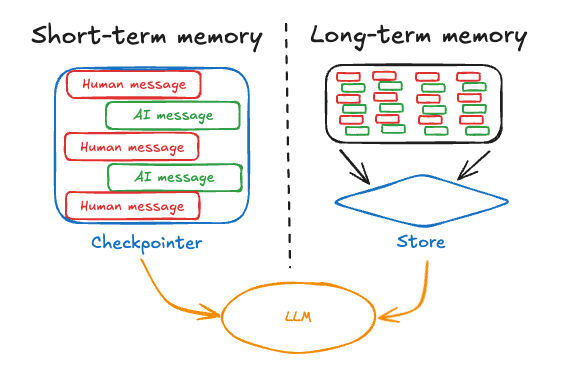

# Understanding the Messages Structure in LLM APIs

## Why Do We Need Messages?

LLMs are **stateless** — they remember nothing between API calls. Every time you call the API, you start fresh.

So to have a real conversation, you must manually send the **entire conversation history** with every request. The `messages` 
array is how you do that.


---

## The Messages Array

The `messages` parameter is a **list of turns** in the conversation. Each message has two fields:

| Field | What it is |
|-------|------------|
| `role` | Who is speaking (`system`, `user`, or `assistant`) |
| `content` | What they said |

---

## The Three Roles

### 1. `system`
- Sets the **behavior, persona, or rules** for the assistant.
- Sent once, at the beginning.
- The model treats this as background instructions — the user doesn't "see" it.

```python
{"role": "system", "content": "You are a helpful assistant named Max."}
```

### 2. `user`
- The **human's input** — questions, requests, commands.

```python
{"role": "user", "content": "What is the capital of France?"}
```

### 3. `assistant`
- The **model's previous responses**.
- You include past assistant replies so the model knows what it already said.

```python
{"role": "assistant", "content": "The capital of France is Paris."}
```

---

## A Full Multi-Turn Example

Here's what a 2-turn conversation looks like when you make the **second API call**:

```python
messages=[
    # Instruction to the model
    {"role": "system",    "content": "You are a helpful assistant named Max."},

    # Turn 1 — User asks
    {"role": "user",      "content": "Hi, what's your name?"},

    # Turn 1 — Model replied (you store this and send it back)
    {"role": "assistant", "content": "Hi! I'm Max, your helpful assistant."},

    # Turn 2 — User asks again (the new message)
    {"role": "user",      "content": "Can you help me with Python?"},
]
```

The model reads all of this and responds to the final `user` message — but now it knows the full context.

---

## How Conversation History Grows

Each time the user sends a message, you **append** to the list:

```
Call 1:  [system, user]
Call 2:  [system, user, assistant, user]
Call 3:  [system, user, assistant, user, assistant, user]
```

> You always end with a `user` message. The model picks up from there.

---

## Visual Structure

```
messages = [
  ┌─────────────────────────────────────────────┐
  │  role: "system"                             │  ← Rules / Persona
  │  content: "You are a helpful assistant..."  │
  └─────────────────────────────────────────────┘

  ┌─────────────────────────────────────────────┐
  │  role: "user"                               │  ← Human speaks
  │  content: "Hi"                              │
  └─────────────────────────────────────────────┘

  ┌─────────────────────────────────────────────┐
  │  role: "assistant"                          │  ← Model's past reply
  │  content: "Hello! How can I help you?"      │
  └─────────────────────────────────────────────┘

  ┌─────────────────────────────────────────────┐
  │  role: "user"                               │  ← New message (current)
  │  content: "Explain RAG to me."              │
  └─────────────────────────────────────────────┘
]
```

---

## Key Rules to Remember

1. **Always start with `system`** (optional but recommended).
2. **Alternate `user` → `assistant` → `user` → ...** — don't put two `user` messages in a row.
3. **Always end with `user`** — that's the message the model responds to.
4. **You must include past turns yourself** — the API does not store history for you.
5. **More history = more tokens** — long conversations increase cost and can hit the context limit.

---

## What Happens If You Don't Include History?

```python
# Call 1
messages=[
    {"role": "user", "content": "My name is Gokul."}
]
# Model replies: "Nice to meet you, Gokul!"

# Call 2 — without history
messages=[
    {"role": "user", "content": "What is my name?"}
]
# Model replies: "I don't know your name."  ← Lost context!
```

Without history, every call is a **blank slate**.

---

## Summary

| Role | Purpose | Required |
|------|---------|----------|
| `system` | Set behavior / persona | Optional (but useful) |
| `user` | Human's input | Yes |
| `assistant` | Model's past replies | Yes (for multi-turn) |

> **In short:** the `messages` array is the model's only "memory." You own it, you manage it. this also called short-term memory.

---

---

# Advanced Approaches to Optimize Context

## The Problem: Context Grows Over Time

Every turn you add to the `messages` array makes the context **bigger**. This causes two real problems:

### 1. Context Size Limit

Every model has a **maximum token limit** (called the context window). Once you hit it, the API throws an error or starts cutting off your input.

| Model | Context Window |
|-------|---------------|
| GPT-4.1 | 1,047,576 tokens |
| Claude Haiku 4.5 | 200,000 tokens |
| gemini-3.1-flash-lite | 1,00,000 tokens |

> A rough rule: **1 token ≈ 0.75 words**. A 10-turn conversation can easily be 2,000–5,000 tokens.

### 2. Cost

LLM APIs charge per token — **both input and output**.

```
Cost = (input tokens + output tokens) × price per token
```

If you blindly append every message, a long conversation keeps sending the full history on every call. By turn 50, you're paying for 49 turns of history that may be mostly irrelevant.

### How It Grows Visually

```
Turn 1:  [system, user]                                        ~50 tokens
Turn 5:  [system, user, asst, user, asst, user, asst, ...]    ~500 tokens
Turn 20: [system, ...18 pairs...]                             ~2,000 tokens
Turn 50: [system, ...48 pairs...]                             ~6,000 tokens
                                                               ↑ growing every call
```

You need a strategy to **keep context small without losing important information**.

---

## Strategy 1: Rolling Window

### What is it?

Keep only the **last N turns** of conversation. Older messages are dropped entirely.

### How it works

```python
MAX_TURNS = 10  # keep last 10 turns (5 user + 5 assistant)

def build_messages(system_prompt, history, new_user_message):
    # Always keep system prompt
    messages = [{"role": "system", "content": system_prompt}]

    # Trim history to last N turns
    trimmed = history[-MAX_TURNS:]

    messages.extend(trimmed)
    messages.append({"role": "user", "content": new_user_message})
    return messages
```

### Example

```
Full history:  [turn1, turn2, turn3, turn4, turn5, turn6, turn7, turn8]
After window:  [                    turn4, turn5, turn6, turn7, turn8]
                                    ↑ only last 5 pairs kept
```

### When to use it

- Simple chatbots where only recent context matters.
- Short task conversations (e.g., coding assistant, Q&A).

### Trade-offs

| ✅ Pros | ❌ Cons |
|--------|--------|
| Simple to implement | Loses old context completely |
| Predictable token cost | Model forgets things said early |
| Fast | Not suitable for long research tasks |

---

## Strategy 2: Recursive Summarization

### What is it?

Instead of dropping old messages, you **compress them into a summary**. When history gets too long, you ask the model to summarize older turns into a single message, then carry that summary forward.

### How it works

```
Step 1: Conversation runs normally.
Step 2: History hits a threshold (e.g., 20 turns).
Step 3: Take the oldest 10 turns → ask model to summarize them.
Step 4: Replace those 10 turns with 1 summary message.
Step 5: Continue the conversation with [system, summary, recent turns].
```

### Code Example

```python
def summarize_old_turns(old_turns: list) -> str:
    """Ask the model to compress old turns into a summary."""
    summary_prompt = [
        {"role": "system", "content": "Summarize the following conversation history concisely."},
        {"role": "user",   "content": str(old_turns)}
    ]
    response = client.chat.completions.create(
        model="gpt-5.4-mini",
        messages=summary_prompt
    )
    return response.choices[0].message.content


def manage_history(history: list, threshold=20, keep_recent=10):
    if len(history) > threshold:
        old_turns   = history[:-keep_recent]   # older half
        recent_turns = history[-keep_recent:]  # recent half

        summary_text = summarize_old_turns(old_turns)

        # Replace old turns with a single summary message
        summary_message = {
            "role": "assistant",
            "content": f"[Summary of earlier conversation]: {summary_text}"
        }
        return [summary_message] + recent_turns

    return history
```

### Visual

```
Before:
[turn1][turn2][turn3][turn4][turn5][turn6][turn7][turn8][turn9][turn10]

After summarization:
[  summary of turn1–turn6  ][turn7][turn8][turn9][turn10]
```

### When to use it

- Long research sessions, document Q&A.
- Customer support bots that run for hours.
- Any use case where early context still matters but can be compressed.

### Trade-offs

| ✅ Pros | ❌ Cons |
|--------|--------|
| Preserves old context in compressed form | Summarization itself costs tokens |
| Handles very long conversations | Summary may lose fine-grained details |
| Scales well | Adds complexity to your code |

---

## Strategy 3: Selective Retention (RAG Approach)

### What is it?

Instead of keeping all history or a fixed window, you **store the full conversation in a vector database** and retrieve only the messages most relevant to the current user query.

This is essentially **RAG applied to conversation history**.

### How it works

```
Step 1: Every user + assistant turn is embedded and stored in a vector DB.
Step 2: When the user sends a new message, embed it.
Step 3: Search the vector DB for the top-K most similar past turns.
Step 4: Inject only those relevant turns into the messages array.
Step 5: Send to the model.
```

### Code Example

```python
from openai import OpenAI
import numpy as np

client = OpenAI(api_key="your_api_key")

# Simple in-memory vector store (use Pinecone/Chroma/Qdrant in production)
vector_store = []  # list of {"text": ..., "embedding": ..., "role": ...}

def embed(text: str) -> list:
    response = client.embeddings.create(
        model="text-embedding-3-small",
        input=text
    )
    return response.data[0].embedding

def cosine_similarity(a, b):
    a, b = np.array(a), np.array(b)
    return np.dot(a, b) / (np.linalg.norm(a) * np.linalg.norm(b))

def store_turn(role: str, content: str):
    vector_store.append({
        "role": role,
        "content": content,
        "embedding": embed(content)
    })

def retrieve_relevant(query: str, top_k=4) -> list:
    query_embedding = embed(query)
    scored = [
        (cosine_similarity(query_embedding, item["embedding"]), item)
        for item in vector_store
    ]
    scored.sort(reverse=True, key=lambda x: x[0])
    return [item for _, item in scored[:top_k]]

def chat(system_prompt: str, user_message: str) -> str:
    # Retrieve relevant past turns
    relevant_history = retrieve_relevant(user_message, top_k=4)

    messages = [{"role": "system", "content": system_prompt}]
    for turn in relevant_history:
        messages.append({"role": turn["role"], "content": turn["content"]})
    messages.append({"role": "user", "content": user_message})

    response = client.chat.completions.create(model="gpt-5.4-mini", messages=messages)
    reply = response.choices[0].message.content

    # Store both turns
    store_turn("user", user_message)
    store_turn("assistant", reply)
    return reply
```

### Visual

```
Full history (100 turns stored in vector DB):
 turn1  turn2  turn3  ... turn50  turn51 ... turn99  turn100

User asks: "What did we decide about the database schema?"

Similarity search finds:
 turn12 (discussed DB schema)
 turn34 (updated schema decision)
 turn89 (revisited schema)
 turn99 (last mention)

Only these 4 turns are injected → model answers with full relevant context.
```

### When to use it

- Very long sessions (100+ turns).
- Domain-specific assistants where topics repeat.
- When you want the most relevant context, not just the most recent.

### Trade-offs

| ✅ Pros | ❌ Cons |
|--------|--------|
| Scales to unlimited history | Requires a vector DB setup |
| Injects only what's relevant | Retrieval can miss things |
| Cost-efficient at scale | More complex to build and maintain |
| Mirrors production RAG pipelines | Embedding cost per turn |

---

## Strategy 4: Long-Term Memory

### What is it?

Long-term memory means **persisting important facts, preferences, and decisions across sessions** — not just within one conversation. When the user comes back tomorrow, the model still knows who they are and what they've discussed before.

This is different from the other strategies — those manage history *within* a session. Long-term memory survives across sessions.

### How it works

```
Step 1: During or after a conversation, extract key facts from the dialogue.
Step 2: Store them in a persistent database (SQL, Redis, or a vector DB).
Step 3: At the start of every new session, load relevant memories.
Step 4: Inject them into the system prompt or as context messages.
Step 5: Model responds as if it "remembers" the user.
```

### Code Example

```python
import json
import redis
from openai import OpenAI

client = OpenAI(api_key="your_api_key")
memory_db = redis.Redis(host="localhost", port=6379, decode_responses=True)

# ── Step 1: Extract facts from the conversation ──────────────────────────────
def extract_memories(conversation: list) -> dict:
    """Ask model to pull out key facts worth remembering."""
    extraction_prompt = f"""
    Extract key facts from this conversation that are worth remembering long-term.
    Return only a JSON object with keys like: name, goals, preferences, decisions, stack.

    Conversation:
    {json.dumps(conversation, indent=2)}
    """
    response = client.chat.completions.create(
        model="gpt-4o-mini",
        messages=[{"role": "user", "content": extraction_prompt}]
    )
    raw = response.choices[0].message.content
    return json.loads(raw)

# ── Step 2: Save to persistent store ─────────────────────────────────────────
def save_memories(user_id: str, memories: dict):
    key = f"memory:{user_id}"
    existing = json.loads(memory_db.get(key) or "{}")
    existing.update(memories)           # merge new facts with old
    memory_db.set(key, json.dumps(existing))

# ── Step 3: Load on next session ─────────────────────────────────────────────
def load_memories(user_id: str) -> dict:
    key = f"memory:{user_id}"
    raw = memory_db.get(key)
    return json.loads(raw) if raw else {}

# ── Step 4: Inject into system prompt ────────────────────────────────────────
def build_system_prompt(user_id: str) -> str:
    memories = load_memories(user_id)
    if not memories:
        return "You are a helpful assistant."

    return f"""You are a helpful assistant.

Here is what you remember about this user from previous sessions:
{json.dumps(memories, indent=2)}

Use this context naturally — don't announce that you remember things, just act on it."""

# ── Step 5: Full chat flow ────────────────────────────────────────────────────
def chat(user_id: str, user_message: str, history: list) -> str:
    system_prompt = build_system_prompt(user_id)

    messages = [{"role": "system", "content": system_prompt}]
    messages.extend(history[-10:])   # rolling window for current session
    messages.append({"role": "user", "content": user_message})

    response = client.chat.completions.create(model="gpt-4o", messages=messages)
    return response.choices[0].message.content

# ── After session ends: extract and save ─────────────────────────────────────
def end_session(user_id: str, full_conversation: list):
    memories = extract_memories(full_conversation)
    save_memories(user_id, memories)
    print(f"Saved memories for {user_id}: {memories}")
```

### Visual

```
Session 1 (Monday):
  User: "I'm building a fraud detection system in FastAPI."
  User: "I prefer async patterns and Redis caching."
  → end of session → extract facts → save to DB

  Stored memory:
  {
    "project": "fraud detection system",
    "stack": "FastAPI, Redis",
    "preferences": "async patterns"
  }

Session 2 (Friday):
  Load memory → inject into system prompt
  User: "Where did I leave off?"
  Model: "You were building a fraud detection system with FastAPI and Redis,
          using async patterns. Want to continue from there?"
                                  ↑ model "remembers" across sessions
```

### When to use it

- Personal assistants and tutors.
- Any app with repeat users (SaaS, productivity tools).
- Anywhere user preferences or ongoing work should persist.

### Trade-offs

| ✅ Pros | ❌ Cons |
|--------|--------|
| Survives across sessions | Requires persistent storage (Redis / DB) |
| Truly personalized experience | Memory extraction can miss or distort facts |
| Scales independently of context window | Privacy implications — you're storing user data |
| Can be updated incrementally | Stale memories can mislead the model |

---

## Comparison: Which Strategy to Use?

| Strategy | Complexity | Memory Quality | Cost Control | Best For |
|----------|------------|---------------|-------------|----------|
| Rolling Window | Low | Recent only | Good | Simple chatbots |
| Recursive Summarization | Medium | Compressed full history | Medium | Long sessions |
| Selective Retention (RAG) | High | Relevant history | Best | Production apps |
| Long-Term Memory | High | Persistent across sessions | Good | Repeat-user apps |

---


## How to maintain the conversation in database?

In production environments, you typically store the conversation history in a database (MySQL, PostgreSQL, MongoDB, etc.)

**I'll attach soon...........**


## 💡 Strategy Combination Tips

You rarely use just one strategy. Here are proven combinations and when to reach for each:

### Combo 1: Rolling Window + Selective Retention (RAG)

```
[system prompt]
+ [RAG-retrieved relevant past turns]   ← semantic search across full history
+ [last 6–8 recent turns]               ← rolling window for continuity
+ [current user message]
```

**Best for:** Conversational search tools, coding assistants, document Q&A bots.

**Why it works:** RAG covers distant but relevant context; the rolling window covers immediate conversational flow. Together they keep tokens low while missing nothing important.

---

### Combo 2: Long-Term Memory + Rolling Window

```
[system prompt + injected long-term memories]   ← loaded from DB at session start
+ [last 8–10 turns of current session]          ← rolling window
+ [current user message]
```

**Best for:** Personal assistants, tutors, productivity apps with repeat users.

**Why it works:** Long-term memory makes the model feel like it "knows" the user. The rolling window handles the current session without overloading the context.

---

### Combo 3: Long-Term Memory + Recursive Summarization

```
[system prompt + long-term memories]    ← persistent facts from past sessions
+ [summary of older turns this session] ← compressed middle
+ [last 6–8 recent turns]               ← fresh context
+ [current user message]
```

**Best for:** Customer support agents, coaching bots, long research sessions.

**Why it works:** You never lose old context — it's either summarized (within session) or extracted to long-term memory (across sessions).

---

### Combo 4: All Four (Full Production Stack)

```
[system prompt]
+ [long-term memories from DB]          ← who the user is, their preferences
+ [summary of older turns]              ← compressed session history
+ [RAG-retrieved relevant turns]        ← precise semantic retrieval
+ [last 6 recent turns]                 ← rolling window
+ [current user message]
```

**Best for:** Production-grade AI assistants, enterprise copilots.

**Why it works:** Every layer serves a different purpose — persistence, compression, relevance, and recency. This is the architecture used by memory-enabled AI products like ChatGPT memory, Mem.ai, etc.

---

### Quick Decision Guide

| Your situation | Use this combo |
|----------------|---------------|
| Simple chatbot, no repeat users | Rolling Window only |
| Long single session, all context matters | Recursive Summarization + Rolling Window |
| Long session, only some turns are relevant | Selective Retention (RAG) + Rolling Window |
| Repeat users, personalization matters | Long-Term Memory + Rolling Window |
| Production app, all of the above | Long-Term Memory + RAG + Summarization + Rolling Window |

---

## Best Practices for Long Conversations

### 1. Always keep the system prompt

Never drop the system prompt from your messages. It sets the model's behavior and should always be the first message.

```python
messages = [{"role": "system", "content": system_prompt}]  # always first
messages += managed_history
messages += [{"role": "user", "content": new_message}]
```

### 2. Track token count proactively

Don't wait for an API error. Count tokens before each call and trim if needed.

```python
import tiktoken

def count_tokens(messages: list, model="gpt-5.4-mini") -> int:
    enc = tiktoken.encoding_for_model(model)
    total = 0
    for msg in messages:
        total += len(enc.encode(msg["content"])) + 4  # ~4 tokens overhead per message
    return total

# Before calling the API:
if count_tokens(messages) > 100_000:
    messages = trim_history(messages)
```

### 3. Use cheaper models for summarization

You don't need GPT-5.4 mini to summarize old turns. Use a cheaper, faster model for that step and save the powerful model for the real task.

```python
# Summarize with cheap model
summary = summarize_with_model(old_turns, model="gpt-5.4-mini")

# Respond to user with full model
reply = respond_with_model(messages, model="gpt-5.4-mini")
```

### 4. Store important facts separately

If the user shares key information early (name, preferences, goals), extract and store it explicitly — don't rely on the model finding it buried in history.

```python
user_context = {
    "name": "Daniel",
    "goal": "Learn Generative AI engineering",
    "stack": "Python, FastAPI, OpenAI"
}

# Inject as part of system prompt
system_prompt = f"""
You are a helpful AI tutor.
User profile: {user_context}
"""
```

### 5. Combine strategies for production

Real production apps rarely use just one approach. A common pattern:

```
[system prompt]
+ [user profile / key facts]        ← extracted and stored separately
+ [summary of old conversation]     ← recursive summarization
+ [relevant retrieved turns]        ← RAG retrieval
+ [last 5–10 recent turns]          ← rolling window
+ [current user message]
```

This gives you the best of all three strategies.

---

## Final Summary

| Problem | Solution |
|---------|---------|
| Context gets too long | Rolling window — keep last N turns |
| Old context is valuable | Recursive summarization — compress, don't drop |
| Huge history, need precision | Selective retention — RAG on conversation |
| User comes back next session | Long-term memory — persist facts across sessions |
| Cost keeps growing | Token counting + cheaper summarization models |
| Critical facts get lost | Extract and store them in the system prompt |
| Production app needs everything | Long-Term Memory + RAG + Summarization + Rolling Window |

> **Key insight:** Context management is not a model problem — it's an **engineering problem**. How you structure and trim the `messages` array directly determines the quality, cost, and reliability of your LLM application.

