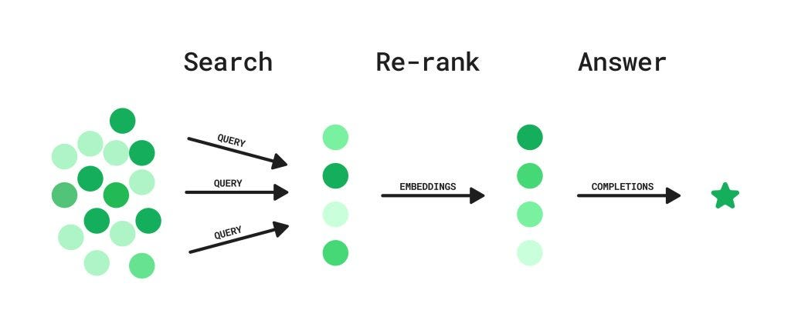
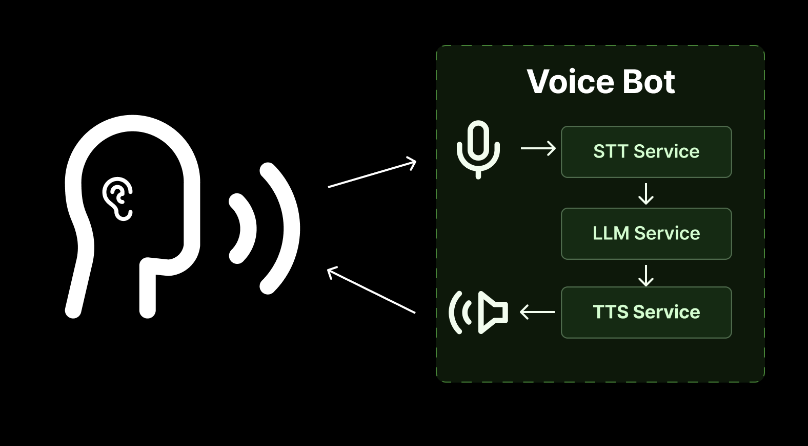

# Basics of Generative AI

## 1. Open-source and Closed-source LLMs

Understanding LLMs, embeddings, TTS, STT, and other models.

### 1.1 Large Language Models (LLMs)

Large Language Models (LLMs) are artificial intelligence models designed to understand and generate human-like text. They are trained on vast amounts of text data and can perform language-related tasks such as: Translation, Summarization, Question-answering, Content generation.

*Open-source vs Closed-source LLMs*

#### Open-source LLMs

- **Alibaba**: Qwen 3.5
- **MoonshotAI**: Kimi 2.5, Kimi 2
- **ZAI**: GLM 5, 4.7, 4.6
- **Meta**: LLaMA 4, LLaMA 3.3, LLaMA 3.2
- **Google**: Gemma 4, Gemma 3
- **Mistral**: Mistral Large 3, Mistral Small 3, Ministral 3, Devstral 3
- **OpenAI**: GPT-oss

📚 [Explore more open-source LLMs](https://huggingface.co/models)

#### Closed-source LLMs

- **OpenAI**: GPT-5.4, GPT-5, GPT-4.1
- **Anthropic**: Claude 4.6 (Opus, Haiku, Sonnet), Claude 4.5, Claude 4
- **Google**: Gemini 3.1 (Pro, Flash), Gemini 2.5 (Pro, Flash)
- **Deepseek**: Deepseek Chat and Reasoner

**Note**: Companies like Groq, Cerebras, and SambaNova host open-source models on their hardware and provide APIs for inference.

---

### 1.2 Embeddings and Rerankers

**Embeddings** are numerical representations of data (text, images, or audio) that capture semantic meaning and relationships. They are used in: Natural language processing, Computer vision, Recommendation systems, Semantic search.

*Embeddings represent data in a continuous vector space, enabling machines to understand and process complex relationships.*

**Rerankers** take a list of candidate outputs (like search results) and rank them based on relevance or quality. They are often used with LLMs to improve output quality.

*Rerankers evaluate and reorder candidate outputs to enhance relevance and quality.*

#### Open-source Embeddings and Rerankers

- **Microsoft**: harrier-oss-v1-27b
- **Google**: EmbeddingGemma-300m
- **Alibaba**: Qwen3-embedding

📚 [Explore more open-source embeddings](https://huggingface.co/models)

#### Closed-source Embeddings and Rerankers

- **OpenAI**: Text-embedding-3-small, Text-embedding-3-large
- **Google** (Multi-modality support): gemini-embedding-2, gemini-embedding-1
- **Cohere**: Embed v4, Embed v3, Reranker v4, Reranker v3
- **Jina AI**: Jina Embeddings 2.0, Jina Embeddings 1.0, Jina Reranker V3

---

### 1.3 Text-to-Speech (TTS) and Speech-to-Text (STT)

**TTS models** generate natural-sounding speech from text input.  
**STT models** transcribe spoken language into written text.

*TTS models convert text to speech, while STT models convert speech to text.*

**Common Applications**:
- Virtual assistants
- Accessibility tools
- Voice-controlled devices

#### Open-source TTS and STT Models

- **Alibaba**: Qwen3 ASR, Qwen3 TTS
- **OpenAI**: Whisper large v3 series
- **NVIDIA**: Personaplex-7b-v1 (Speech-to-Speech)
- **Suno**: Bark TTS

📚 [Explore more open-source TTS and STT models](https://huggingface.co/models)

#### Closed-source TTS and STT Models

- **Google**: gemini-2.5-flash-preview-tts
- **OpenAI**: gpt-4o-mini-tts, gpt-4o-mini-transcribe

### 1.4 Image and Video Generation Models

***Image generation models** create images from text descriptions or other inputs.  
**Video generation models** produce video content based on textual prompts or other media inputs.

**Applications**: Content creation, Design, Entertainment, Advertising, and more.

#### Open-source Image and Video Generation Models

- **Stable Diffusion**: Stable Diffusion 2.1, Stable Diffusion 2.0
- **Runway**: Gen-2
- **Alibaba**: Qwen-Image-Layered

📚 [Explore more open-source image and video generation models](https://huggingface.co/models)

#### Closed-source Embeddings and Rerankers

- **OpenAI**: GPT image 1.5, GPT image 1.0, sora 2 pro.
- **Google** Nano banana 2 and pro, Veo 3.1.

---

### Multi-modal Capabilities

Most modern LLMs support multi-modal capabilities, processing and generating: Text, Images, Audio, Video

**Example**: Google's Gemini 2.5 Flash supports multi-modal input and output, allowing it to understand and generate content across different media types.

---

## 2. Transformers and Other Architectures

Core architecture behind modern generative models.

---

## 3. Model Parameters and Key Terms

Understanding key generation parameters:
- **Top-k**: Limits sampling to the k most likely tokens
- **Top-p (Nucleus sampling)**: Samples from the smallest set of tokens whose cumulative probability exceeds p
- **Temperature**: Controls randomness in output (lower = more deterministic, higher = more creative)
- **Context window**: Maximum number of tokens the model can process at once
- **Max tokens**: Maximum length of generated output
- **Frequency/Presence penalties**: Controls repetition in outputs

---

## 4. Understanding and Hands-on Experience with Tokenizers

Working with tokenization:
- How text is converted to tokens
- Different tokenization strategies (BPE, WordPiece, SentencePiece)
- Token limits and optimization
- Practical implementation with various providers

---

## 5. Hands-on Practice with Text Generation, Vision, TTS, STT, and Embeddings

Practical experience using:
- **OpenAI** APIs
- **Google Gemini** APIs
- **Groq** APIs
- Other providers

Covering:
- Text generation
- Image understanding and generation
- Text-to-Speech (TTS)
- Speech-to-Text (STT)
- Embedding generation

---

## 6. Prompting Best Practices and Strategies

Effective prompt engineering techniques:
- Clear and specific instructions
- Few-shot learning
- Chain-of-thought prompting
- Role-based prompting
- System messages optimization
- Iterative refinement

---

## 7. Context Management

Strategies for managing context windows:
- **Rolling window**: Maintaining recent context by sliding the window
- **Recursive summarization**: Compressing earlier context
- **Selective retention**: Keeping only relevant information
- Best practices for long conversations

---

## 8. Structured Output Generation

Producing structured data:
- Using APIs to generate JSON
- Schema validation
- Framework support (Pydantic, JSON Schema)
- Ensuring consistent output formats

---

## 9. Function Calling

Triggering functions from model outputs:
- API-based function calling
- Framework implementations
- Parameter extraction
- Tool use and execution

---

## 10. Streaming Outputs

Live response streaming:
- Streaming text generation
- Audio streaming
- Implementation using APIs
- WebSocket integration
- Handling partial responses

---

## 11. Real-time APIs

Working with real-time systems:
- Voice-to-voice systems
- OpenAI real-time API
- Low-latency implementations
- Interactive applications

---

## 12. LLM Fine-tuning (Hands-on)

Complete understanding of model customization:

### Pre-training
- Training models from scratch
- Data preparation and curation

### Fine-tuning Techniques
- **PEFT** (Parameter-Efficient Fine-Tuning)
- **LoRA** (Low-Rank Adaptation)
- **QLoRA** (Quantized LoRA)

### Model Alignment
- **RLHF** (Reinforcement Learning from Human Feedback)
- **DPO** (Direct Preference Optimization)
- **PPO** (Proximal Policy Optimization)

---

## 13. Understanding LLM Benchmarks

Key benchmarks for evaluating LLM performance:

### 13.1 GPQA - PhD Science Expertise
- 448 expert-level questions
- Non-PhD humans score only 34% even with web access
- Tests advanced scientific knowledge

### 13.2 MMLU-PRO - Language Understanding
- Advanced version of Massive Multitask Language Understanding
- 10 answer choices instead of 4
- More challenging and cleaned-up question set

### 13.3 AIME - Mathematics
- Hard competitive math puzzles
- From the prestigious, invite-only Math competition
- Designed for top high school students

### 13.4 LiveCode Bench - Coding
- Holistic benchmark for Code LLMs
- Based on problems from:
  - LeetCode
  - AtCoder
  - Codeforces

### 13.5 MuSR - Reasoning
- Logical deduction tasks
- Example: Analyzing 1,000-word murder mysteries
- Tests complex reasoning: "Who has means, motive, and opportunity?"

### 13.6 HLE - Super-human Intelligence
- 2,500+ of the toughest questions
- Subject-diverse and multi-modal
- Designed as the ultimate academic exam for AI

---

## 14. Understanding LLM Evaluation Metrics

### Technical Metrics
- **Perplexity**: Measures how well the model predicts the next token
- **BLEU**: Evaluates translation quality
- **ROUGE**: Measures summarization quality
- **Answer Relevancy**: How relevant the response is to the query
- **Correctness**: Factual accuracy of responses
- **Hallucination**: Detection of fabricated information

📚 [Read more about evaluation metrics](https://www.datacamp.com/blog/llm-evaluation)

### Business Metrics
- Benchmark comparisons
- Return on Investment (ROI)
- Customer satisfaction scores
- Task completion rates
- User engagement metrics

---

## 15. Understanding LLM Inference Metrics

Key performance indicators:
- **Latency**: Time to first token (TTFT) and time per output token (TPOT)
- **Throughput**: Requests per second, tokens per second
- **Memory usage**: GPU/CPU memory consumption
- **Cost efficiency**: Cost per token, cost per request

📚 [Read more about inference metrics](https://bentoml.com/llm/inference-optimization/llm-inference-metrics)

---

## 16. LLM Leaderboards

Popular leaderboards for tracking model performance:
- **Artificial Analysis**: Comprehensive model comparisons
- **Vellum**: Enterprise-focused evaluations
- **Scale.com**: Standardized benchmarks
- **Hugging Face**: Open-source model rankings
- **Live Bench**: Real-time performance tracking

---

## 17. Quantization

Techniques for optimizing LLMs and reducing model size:
- **INT8 Quantization**: 8-bit integer precision
- **INT4 Quantization**: 4-bit integer precision
- **GPTQ**: Post-training quantization
- **AWQ**: Activation-aware Weight Quantization
- **GGUF**: Efficient format for CPU inference

**Benefits**:
- Reduced memory footprint
- Faster inference
- Lower deployment costs
- Minimal accuracy loss

📚 [Read more about quantization](https://cast.ai/blog/demystifying-quantizations-llms/)

---

## 18. Understanding Model Serving and Inference Strategies

Key concepts:
- **Batching**: Processing multiple requests together
- **KV Cache**: Caching key-value pairs for efficiency
- **Speculative decoding**: Faster generation with draft models
- **Continuous batching**: Dynamic request handling
- **Model parallelism**: Distributing models across GPUs
- **Tensor parallelism**: Splitting model layers

---

## 19. Model Hosting and Inference

Tools and frameworks for serving LLMs:

### Inference Servers
- **vLLM**: High-throughput inference with PagedAttention
- **SGLang**: Structured generation language runtime
- **Triton Inference Server**: NVIDIA's multi-framework server
- **LitServe**: Lightning-fast model serving
- **TGI** (Text Generation Inference): Hugging Face's inference server
- **Ollama**: Local model deployment

### Key Features
- GPU optimization
- Request batching
- Multi-model support
- API endpoints
- Monitoring and logging

