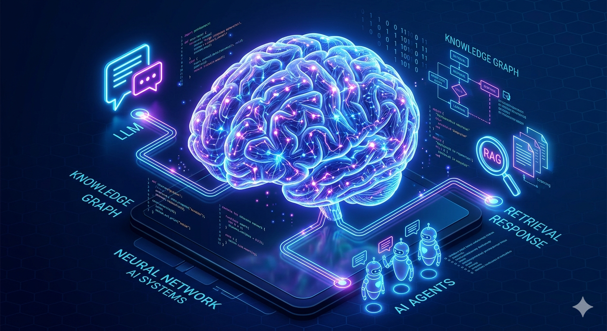
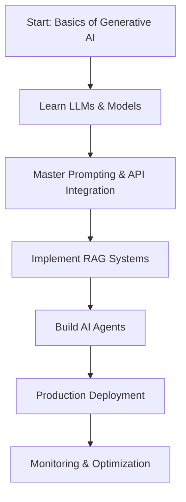

# 🚀 Generative AI Engineer Guide

<div align="center">



**A comprehensive, production-focused guide for engineers building with Generative AI**

[](https://github.com/yourusername/Generative-AI-Engineer-Guide)
[](https://opensource.org/licenses/MIT)
[](http://makeapullrequest.com)

[Getting Started](#-getting-started) • [Learning Path](#-learning-path) • [Topics](#-topics) • [Contributing](#-contributing)

</div>

---

## 📖 About This Guide

This repository is a complete roadmap for engineers who want to master **Generative AI** and build **production-ready applications**. Whether you're a beginner exploring the fundamentals or an experienced developer looking to implement advanced AI systems, this guide provides:

✨ **Comprehensive Coverage**: From LLMs and embeddings to RAG systems and AI agents  
🛠️ **Hands-on Implementation**: Practical examples and real-world applications  
🎯 **Production Focus**: Best practices for deploying and scaling AI applications  
📚 **Curated Resources**: Links to the best learning materials and documentation  
🔄 **Regularly Updated**: Keeping pace with the rapidly evolving AI landscape

---

## 🎯 Who Is This For?

- **Software Engineers** transitioning into AI/ML roles
- **Data Scientists** looking to build production AI systems
- **Full-stack Developers** integrating AI into applications
- **Technical Leads** architecting AI solutions

---

## 📚 Topics

### 1️⃣ [Basics of Generative AI](01-Basics%20of%20Generative%20AI/README.md)

Master the fundamentals of generative AI with **19 comprehensive topics**, including:
- **Open-source & Closed-source LLMs**: Understanding different models (GPT, Claude, Gemini, LLaMA, etc.)
- **Embeddings & Rerankers**: Vector representations and semantic search
- **Text-to-Speech & Speech-to-Text**: Audio processing models
- **Model Parameters**: Temperature, top-k, top-p, context windows
- **Tokenizers**: How text is processed by AI models
- **Prompting Strategies**: Best practices for effective prompt engineering
- **Structured Outputs & Function Calling**: Building reliable AI applications
- **Streaming & Real-time APIs**: Live response generation
- **Fine-tuning**: PEFT, LoRA, QLoRA, RLHF, DPO
- **Evaluation & Benchmarks**: Measuring model performance
- **Quantization & Inference**: Optimizing models for production
- **Model Hosting**: vLLM, SGLang, Triton, LitServe

### 2️⃣ [RAG (Retrieval-Augmented Generation)](02-Retrieval%20Augmented%20Generation/README.md)

Build intelligent retrieval systems that enhance LLM responses:
- **Vector Search & Distance Metrics**: Cosine similarity, Euclidean distance
- **Search Algorithms**: HNSW, IVF, and other efficient indexing methods
- **Embedding Models**: Dense, sparse, and late interaction models (ColBERT, ColPali)
- **Chunking Strategies**: Optimal document segmentation techniques
- **Vector Databases**: Pinecone, Weaviate, Qdrant, Milvus, ChromaDB
- **Hybrid Search**: Combining keyword and semantic search
- **Reranking**: Improving retrieval quality
- **RAG Pipelines**: Building end-to-end retrieval systems
- **RAG Evaluation**: Metrics and best practices
- **Advanced RAG**: Multi-modal RAG, agentic RAG, GraphRAG

### 3️⃣ [Agentic AI](03-Agentic%20AI/README.md)

Create autonomous AI agents that can reason, plan, and execute tasks:
- **Agent Fundamentals**: Understanding agent architectures and workflows
- **Agent Types**: Reactive, multi-agent systems, swarm agents
- **Frameworks**: LangChain, LangGraph, Google ADK, CrewAI
- **Context Management**: Handling long-term memory and state
- **Agent Evaluation**: Metrics, monitoring, and debugging
- **Tool Integration**: Connecting agents with APIs and external services
- **Streaming Support**: Real-time agent interactions
- **Agent Hosting**: LangGraph Cloud, Vertex AI, cloud deployment
- **Memory Systems**: Mem0 and long-term memory patterns
- **Security**: Input validation, guardrails, preventing jailbreaks
- **Advanced Protocols**: MCP, A2A, agent-UI patterns
- **Feedback Loops**: Prompt versioning, cost optimization, human-in-the-loop

---

## 🗺️ Learning Path


---

## 🚦 Prerequisites

Before diving in, you should have:

- ✅ **Programming Experience**: Python (intermediate level)
- ✅ **API Knowledge**: Understanding of REST APIs and asynchronous programming
- ✅ **Basic ML Concepts**: Familiarity with neural networks (helpful but not required)
- ✅ **Development Tools**: Git, terminal/command line, code editor

### Recommended Setup:
- Python 3.8+
- Virtual environment (venv or conda)
- API keys for: OpenAI, Anthropic, or Google AI (for hands-on practice)
- A code editor (VS Code, PyCharm, etc.)

---

## 🚀 Getting Started

1. **Clone the repository**
   ```bash
   git clone https://github.com/yourusername/Generative-AI-Engineer-Guide.git
   cd Generative-AI-Engineer-Guide
   ```

2. **Start with the basics**
   - Begin with [Basics of Generative AI](01-Basics%20of%20Generative%20AI/README.md)
   - Each topic is in its own file for easy navigation
   - Follow the topics sequentially for structured learning
   - Try the hands-on examples and exercises

3. **Experiment and Build**
   - Work through the code examples
   - Build small projects to solidify your understanding
   - Experiment with different models and parameters

4. **Join the Community**
   - Star ⭐ this repository to stay updated
   - Share your learnings and projects
   - Contribute improvements and corrections

---

## 🤝 Contributing

Contributions are welcome and encouraged! Here's how you can help:

- 🐛 **Report bugs** or incorrect information
- 💡 **Suggest new topics** or improvements
- 📝 **Add examples** and code snippets
- 🔗 **Share resources** and learning materials
- ✍️ **Improve documentation** and explanations

Please read our [Contributing Guidelines](CONTRIBUTING.md) before submitting a pull request.

---

## 📚 Additional Resources

### Official Documentation
- [OpenAI Documentation](https://platform.openai.com/docs)
- [Anthropic Claude](https://docs.anthropic.com)
- [Google Gemini](https://ai.google.dev)
- [LangChain Docs](https://python.langchain.com)

### Recommended Courses
- [DeepLearning.AI Short Courses](https://www.deeplearning.ai/short-courses/)
- [Fast.ai Practical Deep Learning](https://course.fast.ai/)
- [Hugging Face NLP Course](https://huggingface.co/learn/nlp-course)

### Communities
- [LangChain Discord](https://discord.gg/langchain)
- [Hugging Face Forums](https://discuss.huggingface.co/)
- [r/MachineLearning](https://www.reddit.com/r/MachineLearning/)

---

## 📄 License

This project is licensed under the MIT License - see the [LICENSE](LICENSE) file for details.

---

## ⭐ Show Your Support

If you find this guide helpful, please consider:
- ⭐ **Starring** this repository
- 🐦 **Sharing** on social media
- 💬 **Providing feedback** through issues
- 🤝 **Contributing** to make it better

---

## 🙏 Acknowledgments

Special thanks to the open-source AI community and all the researchers, engineers, and educators who make learning AI accessible to everyone.

---

<div align="center">

**Made with ❤️ for the AI Engineering Community**

[⬆ Back to Top](#-generative-ai-engineer-guide)

</div>

